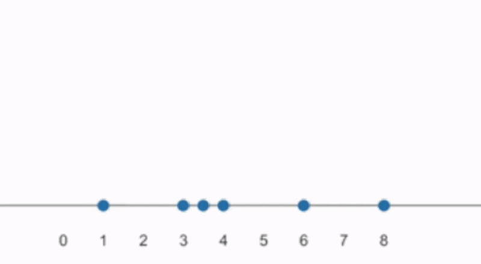



::: {.callout-note title="Learning outcomes & Chapter summary"}

1. **Explain** how kernel density estimation combines contributions centered on individual observations, and how this differs from histogram binning.

2. **Interpret** density heights and areas, distinguishing normalized densities from count-scaled densities.

3. **Adjust** the bandwidth and **evaluate** which features remain visible at different amounts of smoothing.

4. **Evaluate** when density plots may mislead, especially with few observations or bounded variables, and **combine** them with individual observations.

5. **Compare** grouped distributions using density curves, facets, and violin plots, accounting for bandwidth, group sizes, and summary marks.

:::

## Why bother?

In [Binned distributions](9_binned-distributions.qmd),
we used histograms to see patterns that were hidden by overlapping observations.
But the appearance of a histogram depends on the width and placement of its bins.
And when we want to compare several groups in one chart,
overlapping bars can make their shapes difficult to follow.

::: {.callout-default .ex-prompt}

In the previous chapter,
we learned that histograms first divide the axis into bins
and then assign each observation entirely to one bin,
regardless of how close it is to a bin edge.
This gave rise to one of the shortcomings of histograms:
that the exact position of the bins along the axis
could drastically impact the appearance of the histogram
and lead to varying perceptions of the underlying distribution
as we saw in @fig-hist-bin-shift.

Can you try to think of how we could change
the histogram creation process
to remedy this shortcoming?
Study the animated schematic in @fig-hist-buildup again
to help you brainstorm possible improvements.

:::: {.callout-default .ex-hint}

Maybe we could take a more **observation-centric** approach
for the bin placement?

::::: {.callout-default .ex-solution}

Instead of first dividing the axis into bins,
we could center a rectangular window on each observation.
Where nearby windows overlap,
their contributions are added together,
but only for the overlapping part,
as can be seen in this animation:

{#fig-kde-rect-buildup}


This modification removes the need to select
fixed bin boundaries along the axis
and thus the appearance of the distribution
depend only on the width of each bin
(i.e. one parameter less than the histogram).
For a fixed rectangular kernel shape, the estimate depends on the window width
but no longer requires a separate choice of bin origin.

If we applied this technique to the data used in @fig-hist-bin-shift,
we would get the same result for a given window width,
because the windows are centered on the observations.
The chart below shows a coarse stepped approximation of these overlap counts,
using wider bars to make the connection to histograms easier to see;
we will discuss normalization to a probability density next.

```{python}
#| echo: false
#| label: fig-hist-bin-shift-ch10
#| fig-cap: >
#|   The same data as in @fig-hist-bin-shift, using 50-unit windows centered on the observations.
#|   For this illustration, overlap counts are evaluated every 25 units and drawn as broad steps.
#|   These steps approximate the estimate; they are not bins to which observations are assigned.
from random import Random
import altair as alt
import numpy as np
import pandas as pd

cars = alt.datasets.data.cars().copy()
rng = Random(4239402)
bin_min = 235
bin_max = 285

mask_to_replace = cars['Displacement'].between(bin_min, bin_max)
new_values = [rng.choice(range(bin_max, 300)) for _ in range(mask_to_replace.sum())]
cars.loc[mask_to_replace, 'Displacement'] = new_values

values = cars['Displacement'].dropna().to_numpy()
window_width = 50

# Use a coarse display grid to emphasize the connection to histograms.
# At this chart's width, 25-unit display steps have approximately the same
# visual width as the 50-unit bins in the narrower chapter 9 panels.
display_step = 12.5
edges = np.arange(25, 501, display_step)
midpoints = (edges[:-1] + edges[1:]) / 2
overlap_counts = (
    np.abs(midpoints[:, None] - values[None, :]) < window_width / 2
).sum(axis=1)
windows = pd.DataFrame({
    'start': edges[:-1],
    'end': edges[1:],
    'count': overlap_counts,
})

alt.Chart(windows, height=150, width=400).mark_bar(binSpacing=0).encode(
    x=alt.X('start:Q', bin='binned').title(None).scale(domain=[20, 500]),
    x2='end:Q',
    y=alt.Y('count:Q').title(None),
)

```

:::::

::::

:::

<!-- TODO Deep dive: investigate methods for choosing bandwidths and how their objectives compare with bin-width selection. -->
<!-- https://www.mvstat.net/tduong/research/seminars/seminar-2001-05/ -->
<!-- https://astroviking.github.io/ba-thesis/introduction.html#purpose-of-this-thesis -->
<!-- https://mglerner.com/blog/posts/histograms-and-kernel-density-estimation-kde-2/ -->
<!-- https://zfit-tutorials.readthedocs.io/en/latest/tutorials/components/13%20-%20Kernel%20Density%20Estimation.html#improved-sheather-jones-algorithm -->

<!-- SJ https://aakinshin.net/posts/kde-bw/ -->

<!-- TODO histogram advantage = easy to understand -->

## Visualizing distributions with density plots

In the exercise,
we saw how centering a window on each observation
removes the histogram's sensitivity to bin alignment.
Since we are no longer binning the axis
at fixed intervals,
this chart is technically no longer a histogram.
To turn these overlapping contributions into a probability density,
we sum them and normalize the resulting curve so that its total area is one.
This method is called **kernel density estimation**, or **KDE**.
As the name implies,
this method estimates
the unknown probability density function
(i.e. the density of the underlying *population*),
using contributions called kernels.

A kernel describes how an observation's contribution is spread
around its recorded value.
In the exercise above,
we used a rectangular kernel
to make the connection to histograms clearer.
This kernel has a constant height within its window
and drops abruptly to zero outside it.
A smooth kernel instead reduces an observation's contribution gradually
as we move farther from its recorded value.
The most commonly used shape is the Gaussian bell-shaped kernel,
and summing these smooth individual kernels,
then normalizing the total area to one,
produces a smooth density estimate for the distribution,
as we can see in @fig-density-buildup.

{#fig-density-buildup}

<!-- TODO ref origin of gif -->

Let's create a density plot for the entire movie dataset,
before breaking it down into genres.

::: {.panel-tabset group="language"}

### Altair

In Altair,
we first calculate the density with `transform_density`,
then draw the resulting curve with a line or area mark.
The `as_` argument names the two output columns:
`Running Time min` contains positions along the x-axis,
and `Density` contains the estimated density at each position.
We specify `:Q` for the `Density` column
since it is newly created in the transform
and Altair can't infer its type from the dataframe.

```{python}
#| label: runtime-kde-alt
import altair as alt
import pandas as pd

alt.data_transformers.enable('vegafusion');
movies = pd.read_csv('data/movies.csv')

alt.Chart(movies, height=200).transform_density(
    'Running Time min',
    as_=['Running Time min', 'Density'],
).mark_area().encode(
    x=alt.X('Running Time min'),
    y=alt.Y('Density:Q'),
)
```

### ggplot

In ggplot, `geom_density()` both estimates the density
and draws its outline as a line.
We can fill the area under the curve by specifying `fill = 'grey'`
directly in `geom_density()`.

```{r}
#| label: runtime-kde-gg
#| message: false
library(ggplot2)

movies <- readr::read_csv('data/movies.csv')
ggplot(movies, aes(x = `Running Time min`)) +
    geom_density(fill = 'grey')
```

:::

As you can see above,
the y-axis is not showing the count of movies,
but rather their probability *density*,
which means the probability per unit of the x-axis.
A higher curve indicates a greater concentration of observations
around that runtime.

Importantly,
it is the area under the curve over an interval,
rather than the height at a specific point,
that represents an estimated proportion.
The full density curve is normalized to have area one.
Its height therefore depends on the units of the variable:
a density per minute has different numerical values from a density per second,
even though both describe the same observations.

For these reasons,
use densities primarily to understand the shape of a distribution,
rather than reading a density height as a probability.
Although densities are generally correctly interpreted
also by non-technical audiences,
an advantage of histograms
is that they are simpler to interpret and explain.

::: {.callout-warning}

### Avoid interpreting count-scaled densities as bin counts

Multiplying a density by the number of observations
creates a **count-scaled density**.
While this can be useful
to indicate how many observations there are,
it is not as straightforward to interpret
as the counts in a histogram.
The area under its full curve
equals the sample size,
but its height is still a rate:
here, estimated movies **per minute**.
To estimate a count within an interval,
we need the area under the curve over that interval.

Changing measurement units changes this rate.
In @fig-runtime-kde-count-alt,
the right-hand plot expresses runtimes in half-minute units,
so the numerical x-values double and the density heights halve.
The observations and distribution shape are the same.
Simply changing the axis limits would not have this effect.
Count scaling can help communicate relative group sizes,
but labeling the vertical axis merely "counts" can be misleading.

```{python}
#| echo: false
#| label: fig-runtime-kde-count-alt
#| fig-cap: >
#|   The same runtimes measured in minutes (left) and half-minute units (right).
#|   Count-scaled density heights halve when the numerical x-values double.
#|   Bandwidths of 5 minutes and 10 half-minutes give the same amount of smoothing.
density = alt.Chart(movies, height=120, width=220).transform_density(
    'Running Time min',
    as_=['Running Time min', 'Density'],
    counts=True,
    bandwidth=5,
).mark_area(color="#FF0039").encode(
    x=alt.X('Running Time min:Q').scale(zero=False, nice=False).title('Running Time (minues)'),
    y=alt.Y('Density:Q').title('Count-scaled density'),
)

density | alt.Chart(movies.assign(runtime_half_minutes=lambda df: df['Running Time min'] * 2), height=120, width=220).transform_density(
    'runtime_half_minutes',
    as_=['Running Time (half-minutes)', 'Density'],
    counts=True,
    bandwidth=10,
).mark_area(color="#FF0039").encode(
    x=alt.X('Running Time (half-minutes):Q').scale(zero=False, nice=False),
    y=alt.Y('Density:Q').title('Count-scaled density'),
)
```

:::

## Bandwidth

::: {.callout-default .ex-prompt}

Analogous to how we can set the width of each bin in a histogram,
we can also control how wide each kernel should be
via its bandwidth.
For the bell-shaped kernel,
the bandwidth equals its standard deviation.
What do you think happens to the shape of the density curve
when we make the bandwidth larger?

:::: {.callout-default .ex-hint}

You can try a few different bandwidths
on the marathon example from the previous chapter.
Can you see the same features as with the histograms?

```{python}
#| label: fig-marathon-density-bandwidth
#| echo: false
#| fig-cap: >
#|   The same London Marathon finish times shown with different bandwidths.
import numpy as np
from scipy.stats import gaussian_kde

mara = pd.read_csv('data/london_marathon_finish_times.csv')
finish_times = mara['Time (minutes)'].to_numpy()
bandwidths = [0.5, 2, 5, 15]
grid = np.linspace(120, 540, 1681)

# Precompute this widget's curves so switching does not send all runners to the browser
# or repeat the density calculation there. gaussian_kde's factor is relative to the SD.
marathon_densities = pd.concat([
    pd.DataFrame({
        'time': grid,
        'density': gaussian_kde(
            finish_times, bw_method=bandwidth / finish_times.std(ddof=1)
        )(grid),
        'bandwidth': bandwidth,
    })
    for bandwidth in bandwidths
], ignore_index=True)

bandwidth_param = alt.param(
    name='marathon_bandwidth',
    value=2,
    bind=alt.binding_select(options=bandwidths, name='Bandwidth (minutes): '),
)

alt.Chart(marathon_densities, height=200, width=500).transform_filter(
    alt.datum.bandwidth == bandwidth_param
).mark_area(opacity=0.6).encode(
    x=alt.X('time:Q').title('Finish time (minutes)').scale(domain=[120, 540]),
    y=alt.Y('density:Q').title('Density').scale(
        domain=[0, float(marathon_densities['density'].max()) * 1.05]
    ),
    tooltip=[
        alt.Tooltip('time:Q').title('Finish time (min)').format('.1f'),
        alt.Tooltip('density:Q').title('Density').format('.4f'),
    ],
).add_params(bandwidth_param)
```

::::: {.callout-default .ex-solution}

A small bandwidth produces a more detailed, wiggly curve,
whereas a large bandwidth produces a smoother curve.

:::::
::::
:::

One of the advantages of a density over a histogram
is that they are less influenced by the kernel bandwidth
than histograms are by bin width.
It is also notably easier
to optimize for a suitable kernel bandwidth
than a suitable bin width,
so the default rules for density bandwidth estimation
can be quite effective.

However,
as we just saw in the exercise,
there is no single bandwidth that answers every question best.
A wider bandwidth
can help us describe the overall spread of a distribution,
but it can also hide details and multimodality.
A narrower bandwidth is useful
for investigating concentrations near particular values,
but can introduce a spiky appearance
that makes it harder to
see the overall shape of the distribution.

With all that in mind,
let's see how we can change the bandwidth
for our density charts.

::: {.panel-tabset group="language"}

### Altair

Set `bandwidth` in `transform_density()`.
It is measured in the units of the variable being plotted,
so a bandwidth of 2 here means two minutes.

```{python}
#| label: runtime-kde-bandwidth-alt
alt.Chart(movies, height=200).transform_density(
    'Running Time min',
    as_=['runtime', 'density'],
    bandwidth=2,
).mark_area().encode(
    x=alt.X('runtime:Q').title('Running time (min)').scale(zero=False),
    y=alt.Y('density:Q').title('Density'),
)
```

The default bandwidth estimation in Altair
is not very sophisticated,
so it is particularly important to try different bandwidths.
Try several bandwidths rather than assuming that the default best answers your question.

### ggplot

Set `bw` in `geom_density()`.
It is measured in the units of the variable,
so `bw = 2` uses a bandwidth of two minutes.

```{r}
#| label: runtime-kde-bandwidth-gg
ggplot(movies, aes(x = `Running Time min`)) +
    geom_density(bw = 2, fill = 'grey80') +
    labs(x = 'Running time (min)', y = 'Density')
```

If left unset,
the default bandwidth selection rule
is not very sophisticated,
but it is possible to switch to the Sheather-Jones rule
which is among the best in finding a reasonable bandwidth.
The choice can be particularly noticeable for multimodal distributions.
[R's documentation](https://rdrr.io/r/stats/density.html) notes that the default
is retained for historical compatibility rather than as a general recommendation,
and suggests Sheather–Jones as a preferred alternative.

```{r}
#| label: runtime-kde-bandwidth-sj-gg
ggplot(movies, aes(x = `Running Time min`)) +
    geom_density(bw = 'SJ', fill = 'grey80') +
    labs(x = 'Running time (min)', y = 'Density')
```


:::

<!-- TODO Deep dive into bandwidth selection. -->

::: {.callout-warning}

### Avoid assigning density to impossible values

Since each observation contributes to the overall density
with a kernel centered on the observation,
this could lead to the density curve
extending into ranges that are impossible
for the measured variable.
Take the (fictional) data set below
about how much time students spend on their phone during a 60-min lecture.
The KDE on the right assigns density to negative durations,
even though phone-use time must be between 0 and 60 minutes.

In general,
it is acceptable that the KDE
extends beyond a minimum or maximum value in a sample
as long as those values are sensible for the variable
Since those the sample’s minimum and maximum are not necessarily population boundaries,
so extending beyond them can be appropriate when estimating the population distribution
It can,
however,
still be a good idea to clip the displayed curve
at the most extreme values of the sample
to clearly signal where the sample data ends
(and with the Gaussian kernels used here,
the omitted tails would simply taper smoothly toward zero).

```{python}
#| echo: false
#| label: fig-kde-beyond-range
#| fig-cap: >
#|   The same KDE displayed only over the observed range (left) or beyond it (right).
#|   The red curve is multiplied by the sample size and 3-minute bin width for
#|   comparison with the histogram counts. Truncating the display hides the negative tail
#|   rather than re-computes and corrects the KDE near the boundary.
# Synthetic observations: 23 students in a 60-minute lecture.
df = pd.DataFrame({"minutes": [
    0.4, 0.5, 0.6, 0.7,
    1.9, 2, 2.2, 2.5, 2.8, 3.2, 3.8, 4.5, 5.5, 6.5,
    8, 10, 12, 15, 18, 22, 27, 33, 40,
]})

bin_width = 3
bandwidth = 2.5
x_domain = [-10, 50]
observed_range = [float(df.minutes.min()), float(df.minutes.max())]

histogram = alt.Chart(df).mark_bar(
    color="#b8c0c8", opacity=0.65, binSpacing=0
).encode(
    x=alt.X("minutes:Q",
            bin=alt.Bin(step=bin_width, extent=[0, 50]),
            scale=alt.Scale(domain=x_domain, nice=False),
            axis=alt.Axis(values=list(range(-10, 51, 10))),
            title="Minutes of phone use during lecture"),
    y=alt.Y("count():Q", title="Students (per 3-minute bin)"),
)


def panel(extent):
    kde = (
        alt.Chart(df)
        .transform_density(
            "minutes", bandwidth=bandwidth, counts=True,
            extent=extent, steps=601, as_=["minutes", "density"]
        )
        # counts=True gives n * density; multiply by bin width
        # to express the KDE as an approximate count per bin-width interval.
        .transform_calculate(smoothed_count=f"datum.density * {bin_width}")
        .mark_area(color="#FF0039", opacity=0.2,
                   line={"color": "#FF0039", "strokeWidth": 2})
        .encode(
            x=alt.X("minutes:Q",
                    scale=alt.Scale(domain=x_domain, nice=False),
                    axis=alt.Axis(values=list(range(-10, 51, 10))),
                    title="Minutes of phone use during lecture"),
            y=alt.Y("smoothed_count:Q", title="Students (per 3-minute bin)"),
        )
    )
    return (histogram + kde).properties(
        width=260, height=160
    )

chart = (
    alt.hconcat(
        panel(observed_range),
        panel(x_domain),
    )
    .resolve_scale(x="shared", y="shared")
)

chart
```

Limiting the display to the observed range, as on the left, hides the impossible tail
but also removes unobserved values that could be possible.
It neither corrects boundary bias nor renormalizes the truncated curve.
For bounded variables, consider a boundary-aware density estimator
or a histogram with bins restricted to the valid range.

:::

## Adding back individual observations

::: {.callout-default .ex-prompt}

The curve below was calculated from a set of movie runtimes.
Before opening the solution,
sketch what you think the individual observations
might look like along the x-axis:
use a small tick for each movie to create a **rug plot**.
Roughly how many ticks would you draw, and where would you place them?

```{python}
#| label: sparse-runtime-density-question
#| echo: false
runtime_values = movies['Running Time min'].dropna().sort_values().to_numpy()
# Deliberately choose five observations spread across the empirical distribution.
# These are the observations nearest the midpoints of five equal-sized groups.
sparse_indices = ((np.arange(5) + 0.5) * len(runtime_values) / 5).astype(int)
sparse_runtimes = runtime_values[sparse_indices]
sparse_grid = np.linspace(40, 260, 441)
sparse_bandwidth = 18

runtime_comparison = pd.concat([
    pd.DataFrame({
        'runtime': sparse_grid,
        'density': gaussian_kde(
            values, bw_method=sparse_bandwidth / values.std(ddof=1)
        )(sparse_grid),
        'sample': label,
    })
    for label, values in [('Five movies', sparse_runtimes), ('All movies', runtime_values)]
], ignore_index=True)
runtime_density_limit = float(runtime_comparison['density'].max()) * 1.05

def runtime_comparison_curve(label, width=420, height=160):
    return alt.Chart(
        runtime_comparison[runtime_comparison['sample'] == label],
        width=width, height=height,
    ).mark_area(opacity=0.6).encode(
        x=alt.X('runtime:Q').title('Running time (min)').scale(domain=[40, 260]),
        y=alt.Y('density:Q').title('Density').scale(domain=[0, runtime_density_limit]),
    )

runtime_comparison_curve('Five movies')
```

:::: {.callout-default .ex-hint}

Remember that the area under the curve is normalized to one
regardless of the number of movies.
Does a smooth outline necessarily imply
that there are many underlying observations
or could a very different number of observations produce a similar curve?

::::: {.callout-default .ex-solution}

There are only **five movies** behind this curve!
Their runtimes are 87, 95, 104, 117, and 137 minutes.
Compare their density and rug with those for all **797 movies**:

```{python}
#| echo: false
#| label: fig-sparse-runtime-density-reveal
#| fig-cap: Two nearly identical density charts with very different numbers of underlying observations.

runtime_reveal_panels = []
for label, values in [('Five movies', sparse_runtimes), ('All movies', runtime_values)]:
    curve = runtime_comparison_curve(label, width=230, height=140)
    ticks = alt.Chart(pd.DataFrame({'runtime': values}), height=25, width=230).mark_tick(
        opacity=0.4,
    ).encode(
        x=alt.X('runtime:Q').title('Running time (min)').scale(domain=[40, 260]),
    )
    runtime_reveal_panels.append(
        (curve & ticks).resolve_scale(x='shared').properties(title=f'{label} (n = {len(values)})')
    )

alt.hconcat(*runtime_reveal_panels)
```

The curves use the same bandwidth and look nearly identical,
but visualizing the individual observations
reveals very different amounts of underlying data.
The smoothness of the curve
comes from the density estimation procedure,
not from having many observations
to support a smooth distribution.
The five-movie curve gives a much
weaker basis for claims about the population's shape,
even though it looks just as convincing.

:::::

::::

:::

::: {.callout-warning}

### Avoid trusting a density curve just because it looks smooth

Unlike a histogram of counts,
a standard density plot does not tell us
how many observations fall within an interval;
its total area is normalized to one,
whether it represents five movies or five hundred.
A smooth curve is not evidence of a well-supported distribution,
so inspect the underlying observations and report the sample size.
Histograms normalized to density or proportion also hide the total sample size.

:::

As with histograms, we can add individual observations below a density curve
using a rug plot.
This is especially helpful since density smoothing
might conceal how sparse the data is.
This can help us see
whether a bump in the density corresponds
to a concentration of observations,
and where a smooth curve extends beyond the observed values.

::: {.panel-tabset group="language"}

### Altair

We create the density and rug separately, then concatenate them vertically with `&`.
Sharing the x-scale keeps the ticks aligned with their positions on the curve.

```{python}
#| label: runtime-kde-rug-alt
density = alt.Chart(movies, height=200).transform_density(
    'Running Time min',
    as_=['runtime', 'density'],
    bandwidth=5,
    extent=[40, 260],
).mark_area().encode(
    x=alt.X('runtime:Q').title('Running time (min)'),
    y=alt.Y('density:Q').title('Density'),
)

rug = alt.Chart(movies, height=25).mark_tick(opacity=0.25).encode(
    x=alt.X('Running Time min:Q').title('Running time (min)'),
)

(density & rug).resolve_scale(x='shared')
```

### ggplot

We add `geom_rug()` to place the individual observations in the margin of the plot.
Transparency helps reveal where many ticks overlap.

```{r}
#| label: runtime-kde-rug-gg
ggplot(movies, aes(x = `Running Time min`)) +
    geom_density(bw = 5, fill = 'grey80') +
    geom_rug(alpha = 0.25) +
    scale_x_continuous(limits = c(40, 260)) +
    labs(x = 'Running time (min)', y = 'Density')
```

:::

## Multiple distributions

### Contrasting small differences with density lines

As with histograms,
it can also be beneficial to stratify densities
into separate facets
when comparing the distributions of multiple groups.
One drawback of faceting
is that it can be difficult to compare small differences
since the distributions are now far apart.
As we learned in [Groups](5_groups.qmd),
to highlight small differences between groups,
we want their visual components close together.
But we also learned in [Binned distributions](9_binned-distributions.qmd)
that with several distributions in the same chart,
overlapping distributions can obscure one another.
To overcome this obstacle,
we could visualize density curves with lines
instead of areas.
While visualizing a histogram with a line is possible,
it is generally easier to separate the groups
when using the smooth density curves.
<!-- TODO ad anot about frequency polygons when they are covered in ch 9 binned-->

::: {.panel-tabset group="language"}

#### Altair

Since we are coloring by `Major Genre`,
we need to include it as a grouping variable
in the transform so that a separate density
is computed for each genre.

```{python}
#| label: genre-kde-lines-alt
alt.Chart(movies, height=200).transform_density(
    'Running Time min',
    as_=['Running Time min', 'Density'],
    groupby=['Major Genre'],
).mark_line().encode(
    x=alt.X('Running Time min:Q'),
    y=alt.Y('Density:Q'),
    color='Major Genre',
)
```

#### ggplot

```{r}
#| label: genre-kde-lines-gg
ggplot(movies, aes(x = `Running Time min`, color = `Major Genre`)) +
    geom_density(bw = 'SJ')
```

:::

::: {.column-margin}

Note the impact of the various default bandwidth selection rules
from different libraries.

:::

Each group's full density curve has area one,
regardless of how many movies are in that group.
This lets us compare the density *shapes*
without a larger group automatically having a taller curve.
It also means that a taller peak
does not indicate more movies,
but rather a greater concentration
relative to other runtimes within that group.
If the number of observations is central to the question,
show group sizes separately
or use count-scaled densities
(while remembering the caveats of count-based densities mentioned earlier).

### Violins for compact spatial separation

We have already learned about facetting
as one strategy to separate groups spatially.
We have also seen that it can be beneficial
to distribute the groups along the x or y axis
to introduce some spatial separation,
but still having them near each other for easier comparison.
While it is possible to do this with density curves directly,
a more common way is to use a so called violin plot.

Violin plots mirror a density estimate around a group’s position,
creating a centered shape
that can accommodate a boxplot or other summary marks.
The thickness of the violin at a particular runtime
thus corresponds to how concentrated the observations are there.
Their original authors
suggested that the symmetry makes density magnitude easier to perceive,
although this has not been experimentally confirmed,
and [it has been argued
that the mirroring is redundant](https://pmc.ncbi.nlm.nih.gov/articles/PMC6480976/).
Mirroring adds no statistical information,
so a one-sided density combined with a boxplot and individual observations
is a similarly useful alternative,
but not always as readily available in visualization libraries.

As with densities,
we can also scale the areas of violins to reflect group sizes.
This gives an indication of the relative sizes between groups,
but can make it harder to see the distribution
of groups with few observations.

::: {.panel-tabset group="language"}

#### Altair

In Altair,
there is no dedicated violin mark,
although violins can be constructed using density transforms and area marks.
Here, we use compact faceted densities as a simpler alternative.
We style these facets
to make them less prominent
and bring the densities closer to each other
for easier comparison.
This makes the code more verbose
and it is not strictly necessary
for an effective visualization.

```{python}
#| label: compact-densities-alt
alt.Chart(movies, height=60).transform_density(
    'Running Time min',
    groupby=['Major Genre'],
    as_=['Running Time min', 'Density'],
    bandwidth=5,
).mark_area().encode(
    x=alt.X('Running Time min:Q'),
    y=alt.Y('Density:Q').axis(None),
).facet(
    row=alt.Row('Major Genre:N').header(
        labelAngle=0, labelAlign='left', labelAnchor='start'
    ).title(None),
    spacing=0
).configure_view(
    stroke=None
)
```

#### ggplot

`geom_violin()` calculates the density
and draws the mirrored violin shape.
With `scale = 'count'`, violin areas are proportional to group density sizes.
By default, the violins are trimmed to the observed range of each group,
just like the densities.

```{r}
#| label: runtime-violins-gg
#| fig-height: 4
ggplot(movies, aes(x = `Running Time min`, y = `Major Genre`)) +
    geom_violin(bw = 'SJ', fill = 'grey80')
```

:::

We can extend this approach
to compare multiple groups within the same genre.
To illustrate this,
we keep movies rated G, PG, PG-13, or R
and create two rating groups: **G/PG** and **PG-13/R**.
G/PG movies are generally more family-oriented,
while PG-13/R movies carry stronger content advisories or restrictions.
We count-scale these density estimates
as an indication of the relative sizes
of these two groups within each genre.

In addition to the densities,
we also visualize summary statistics of each group
to facilitate comparing both the distribution
and central tendency of the observations.

::: {.panel-tabset group="language"}

#### Altair

```{python}
#| label: compact-densities-groups-alt
rating_movies = movies[
    movies['MPAA Rating'].isin(['G', 'PG', 'PG-13', 'R'])
].copy()
rating_movies['Rating group'] = (
    rating_movies['MPAA Rating']
    .isin(['G', 'PG'])
    .replace({True: 'G/PG', False: 'PG-13/R'})
)
alt.layer(
    alt.Chart(rating_movies).mark_rule().encode(
        x=alt.X('mean(Running Time min)').title('Running time min'),
        color='Rating group'
    ),
    alt.Chart(rating_movies, height=60).transform_density(
        'Running Time min',
        groupby=['Major Genre', 'Rating group'],
        as_=['Running Time min', 'Density'],
        bandwidth=5,
        counts=True,
    ).mark_area(opacity=0.5).encode(
        x=alt.X('Running Time min:Q'),
        y=alt.Y('Density:Q').axis(None).stack(False),
        color='Rating group',
    )
).facet(
    row=alt.Row('Major Genre:N').header(
        labelAngle=0, labelAlign='left', labelAnchor='start'
    ).title(None),
    spacing=0
).configure_view(
    stroke=None
)
```

#### ggplot

The 25th, 50th (median), and 75th percentiles
are computed by default in `geom_violin()`
and we can make them visible by setting the style of the quantile lines.

```{r}
#| fig-height: 6
#| fig-width: 6
#| label: runtime-violins-groups-gg
movies |>
    dplyr::filter(`MPAA Rating` %in% c('G', 'PG', 'PG-13', 'R')) |>
    dplyr::mutate(
        `Rating group` = dplyr::if_else(
            `MPAA Rating` %in% c('G', 'PG'), 'G/PG', 'PG-13/R'
        )
    ) |>
    ggplot(
        aes(
            x = `Running Time min`,
            y = `Major Genre`,
            fill = `Rating group`
        )
    ) +
    geom_violin(bw = 'SJ', quantile.linetype = 3, scale = 'count') +
    geom_point(
        stat = 'summary',
        fun = mean,
        position = position_dodge(0.9)
    )
```

We use `position_dodge(0.9)` to align each mean point with its subgroup's violin,
which is already dodged by default.

:::

We can see that G- and PG-rated movies in this dataset
tend to be shorter
and that this difference is especially pronounced
for adventure movies.
There are no G- or PG-rated horror movies in this sample,
which aligns with out expectations
of low demand for this genre in among younger audiences.

<!-- TODO sina density clouds -->
