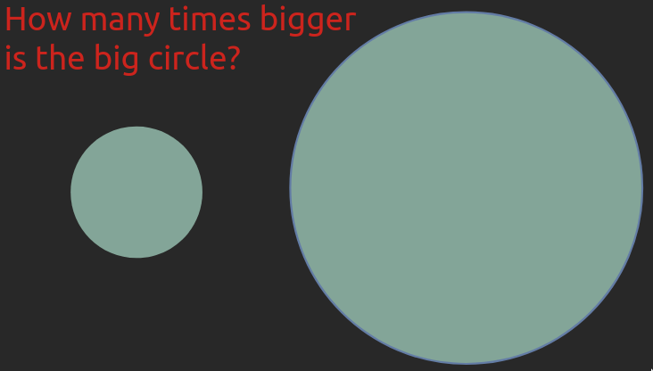
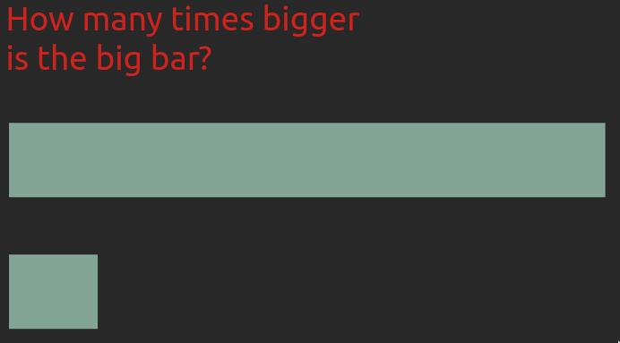
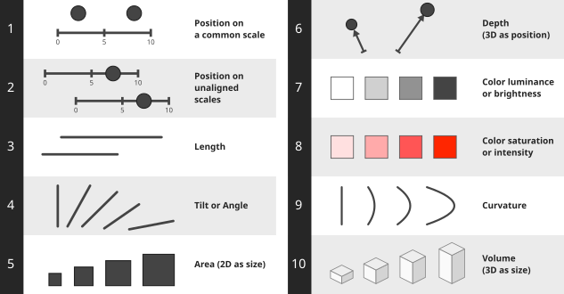

# Magnitude {#sec-magnitude}



<!-- TODO Talk about different data types here? Also consider chapter naming: is "magnitude" just "quantitative"/"continuous", and is "groups" just "nominal"/"ordinal"? -->

:::: {.slide-outcomes}

::: {.callout-note title="Learning outcomes & Chapter summary"}

1. **Choose** effective visual channels for comparing quantitative magnitudes.

2. **Explain** why position and length are generally easier to compare than area, and why unnecessary 3D can mislead.

3. **Evaluate** how color and spatial representation affect the accuracy of visual interpretation.

:::

::::

## Why bother?

In the last chapter,
we saw how we could visualize magnitude
as either the position of a point along an axis
or as the brightness of the point's color.
We can refer to these different ways
of representing a quantity graphically
as visual "channels".
There are many more visual channels
than position and brightness,
and when we visualize something,
we want to think about
which are the most effective channels
that we can use to understand the data.

As in many cases,
an efficient way to learn this topic is through personal experience,
rather than just being told the answer.
So let's experience how some visual channels are more effective than others
through a short exercise.

::: {.callout-default .ex-prompt}

Take a few seconds to answer the following question.
How many times larger is the bigger object
as the smaller one in each of these two images?

:::::: {.slide-visual slide-layout="columns"}





::::::

*Remember that we learn more effectively
when we actively try to answer questions like these
instead of viewing the solution right away.*

:::: {.callout-default .ex-hint}

What do you think is meant by "bigger"
when it comes to the circles?
Are you supposed to compare the areas or the diameters?

::::: {.callout-default .ex-solution}

The larger circle has seven times the area of the smaller circle,
and the longer bar has seven times the length of the shorter bar.[^jeffrey-heer]

[^jeffrey-heer]: These two examples are from [Jeffrey Heer's PyData talk](https://www.youtube.com/watch?v=hsfWtPH2kDg).
Heer is a visualization researcher at the University of Washington
and a coauthor of the research papers introducing D3 and Vega-Lite.

:::::: {.slide-visual slide-title="Area versus length"}


::::::

Most people find that it is much easier
to compare the length and position of the bars
aligned to the same baseline
than to estimate the areas of the circles.
For bars,
it is also immediately clear what to compare
as long as their widths are kept constant,
whereas for the circles we might hesitate between area and diameter.
This is important to keep in mind,
especially when communicating to others via visualization,
but also when creating plots for yourself.

Even if you aced both comparisons yourself,
the fact that many people tend to get one of them wrong more often
means that in order for you to create effective visualizations
you need to know which visual channels are the easiest for humans to decode.

:::::
::::
:::

## Visual channel effectiveness

There has been plenty of research
trying to determine which visual channels
are the most effective
when communicating different aspects
of a dataset.
The findings from these studies provide us
with a useful guiding foundation
that we should only stray from with good reason.
The main findings
are summarized in the schematic below,
from the most to the least effective visual channel.

:::: {.slide-visual}

::: {#fig-mag width=633.6 fig-alt="Ten channels in classical magnitude order: common-scale position, unaligned-scale position, length, tilt or angle, area, depth, luminance, saturation, curvature, and volume."}



Classical visual-channel ranking for quantitative magnitude judgments.
Adapted from [Visualization Analysis and Design](https://www.cs.ubc.ca/~tmm/vadbook/figures.html),
Tamara Munzner, with illustrations by Eamonn Maguire (2014, CC BY 4.0).

:::

::::

::: {.column-margin}

What is regarded as visually salient
might vary across cultures, geographic regions, and age groups.
This is important to remember since much of this research
has been carried out with college students
in North America and Europe.
More recent studies
have shown that the chart's purpose
and the combination of visual channels
affect which ways of depicting magnitude are most effective.^[[Revisiting Channel Effectiveness: A Multi-Dimensional Evaluation with Primitive Visual Stimuli](https://arxiv.org/html/2608.04435v1)]

:::

Position along a common scale is generally the most effective visual channel
for precise magnitude comparisons,
so we should use it for our most important comparisons when possible.
In a scatterplot, for example, position along the x- and y-axes represents two variables,
but we can also use size or color to represent additional variables.
Although it is harder to judge exact quantities from these channels
(is this dot's area exactly twice that of another?),
they can still help us see trends in the data.

### Unnecessary 3D makes plot interpretation harder

Three-dimensional plots are especially problematic when the extra dimension
serves only as decoration, as in a 3D bar or pie chart.
Even when depth represents data, as in a 3D scatterplot,
positions can be difficult to compare.
This is particularly challenging in a static image on paper,
where the reader cannot rotate the plot to inspect it from different angles.

:::: {.callout-default .ex-prompt}

[Which value do you think is represented by the bar labelled "B"
in the 3D bar chart below?]{.slide-bullet}

::::: {.slide-visual}


:::::

::: {.callout-default .ex-solution}

The bars appear to have values of approximately A = 0.7, B = 1.7, C = 2.7, and D = 3.7,
but this is an illusion caused by
the viewing angle of the "camera" in this 3D scene.
The actual values of A, B, C, and D are 1, 2, 3, and 4, respectively.
This plot would have been much easier to read without the unnecessary 3D effect.

:::
::::

### Meaningful 3D can facilitate plot interpretation

Sometimes 3D can be useful,
such as in a topographic map or a visualization of a protein's structure.
Below you can see [examples created with the rayshader library](https://www.tylermw.com/3d-ggplots-with-rayshader/)
that use 3D representations and camera rotation to help us interpret spatial relationships.
The example on the right visualizes the curvature of spacetime via 3D position (depth),
eliminating the need for the additional 2D plot shown in the example on the left.

::: {.slide-visual}

{#fig-3d-movie width=70%}

:::

But be cautious:
we will see in the next section that even for systems such as blood vessels,
which are naturally organized in three dimensions,
it can be more mentally demanding to interpret a 3D visualization accurately.
[Claus Wilke has written a helpful chapter](https://clauswilke.com/dataviz/no-3d.html) on this topic
if you are interested in learning more.

## Well-designed visualizations can support clinical decisions

The importance of these best practices
might seem a bit abstract until you experience their effects yourself.
Let's look at a concrete example
of how changing visualization methods improved performance on a medically relevant task.

Heart disease is the most common cause of death,
killing almost 9 million people each year,
or as many as diabetes, dementia, neonatal conditions, and respiratory infections
combined.
Low wall shear stress—the frictional force per unit area exerted by blood on an artery wall—
is associated with the development of atherosclerosis.
Identifying these regions can therefore help clinicians assess areas at risk.

To evaluate the shear stress in the arteries,
one approach is to use a digital 3D representation of the artery
colored according to the magnitude of shear stress,
which is what you can see in the picture below.
The colormap changes from blue for the areas of interest (low stress)
to cyan, green, yellow, and red for higher stress.

In a 2011 study, Michelle Borkin and colleagues tested how effective this type of visualization was
compared to alternatives using 2D representations and a diverging color scale.^[Borkin et al. (2011), [*Evaluation of Artery Visualizations for Heart Disease Diagnosis*](https://doi.org/10.1109/TVCG.2011.192), *IEEE Transactions on Visualization and Computer Graphics*, 17(12), 2479–2488. See Section 6.2 for the participants and Figure 7 for the percentages ([open-access PDF](https://iis.seas.harvard.edu/papers/2011/borkin11-infoviz.pdf)). The study is also discussed around 1:02 in [*A Better Default Colormap for Matplotlib*, SciPy 2015](https://www.youtube.com/watch?v=xAoljeRJ3lU&t=62s), by Nathaniel Smith and Stéfan van der Walt.]
The experiment involved 21 Harvard medical students,
who were asked to identify regions of low shear stress.
When using the visualization you see below,
they correctly identified an average of ~40% of these regions.

::: {.slide-fragment .slide-columns}


:::

### Changing the color scale almost doubled the accuracy {.slide-skip}

One comparison tested the effect of changing the color scale to one that is easier to interpret
and makes the important areas of low shear stress stand out more,
by highlighting them in bright red
and showing the remaining areas in shades of gray.
With this seemingly small modification,
the percentage of low-shear-stress regions correctly identified almost doubled,
from 40% to 70% for the 3D representations.

We will talk more about choosing appropriate color scales in later chapters.

::: {.slide-fragment}


:::

### Changing from 3D to 2D improved accuracy further {.slide-skip}

Another comparison tested changing from a 3D representation of the blood vessels
to a 2D representation while using the diverging color scale.
Although a 3D representation preserves more of the vessels' anatomical geometry,
it is also more cognitively demanding for us to process,
and some areas can cover others
so it is harder to get a quick overview of the vessels.
In the 2D visualization,
the blood vessels and their branching points
are shown in a schematic that is less cognitively demanding to interpret.
This representation was also shown to be more effective,
as 90% of the low-shear-stress regions were correctly identified on average.

Overall,
these two changes more than doubled the percentage of regions correctly identified,
from 40% to 90%.
That is a huge increase from modifications
that might have seemed to be merely a matter of taste without knowledge of visualization theory!
So, if anyone tells you that visualization of data is not as important as other components,
you can tell them about this study
and ask them what kind of visualization
they want their doctor to look at
when analyzing their arteries.

::: {.slide-fragment}


:::

As with many things,
there are situations where you can depart from these guidelines
if you are sure about what you are doing
and are trying to create a specific effect in your communication.
But most of the time,
it is best to adhere to the principles discussed above
and we will dive deeper into some of them later in the book.

## Choose the most effective channel for the most important comparison

Let's apply what we have learned
in the context of the dataset from last chapter.

::: {.panel-tabset group="language"}

### Altair {.slide-skip}

```{python}
#| label: load-cars-python
#| output: false
import altair as alt
import pandas as pd


url = 'https://raw.githubusercontent.com/joelostblom/teaching-datasets/main/cars.csv'
cars = pd.read_csv(url)
```

### ggplot {.slide-skip}

```{r}
#| label: load-cars-r
#| output: false
library(ggplot2)


url <- 'https://raw.githubusercontent.com/joelostblom/teaching-datasets/main/cars.csv'
cars <- readr::read_csv(url)
```

:::

If we are interested in visualizing
the relationship between
`'Miles_per_Gallon'`,
`'Horsepower'`,
and `'Weight_in_lbs'`.
If all pairwise relationships were of high importance,
we could created three separate plots
where each variable get to be on the x and y axis two times each,
so that they can make use of the most effective channel,
position on a shared scale.

However,
if we would like to include all three variables
in the same chart,
then we would need to decide what the most important comparison is.
If it is to compare fuel efficiency to weight,
then we would make the following chart:

::: {.panel-tabset group="language"}

### Altair

```{python}
#| label: cars-weight-alt
#| slide-show: both
#| slide-output-fragment: true
alt.Chart(cars).mark_point().encode(
    x='Miles_per_Gallon',
    y='Weight_in_lbs',
    color='Horsepower'
)
```

### ggplot

Here,
we add the `color` encoding to the chart
so that we can see how all three variables
relate to each other.
The default color gradient runs from dark blue for lower weights
to light blue for higher weights,
since light colors have the highest contrast
to the chart's dark background.

```{r}
#| label: cars-weight-gg
#| slide-show: both
#| slide-output-fragment: true
ggplot(cars, aes(x = Miles_per_Gallon, y = Weight_in_lbs, color = Horsepower)) +
    geom_point()
```

:::

If we instead are mainly interested in comparing,
engine power vs weight,
then we would make the following chart:

::: {.panel-tabset group="language"}

### Altair

```{python}
#| label: cars-weight-2-alt
#| slide-show: both
#| slide-output-fragment: true
alt.Chart(cars).mark_point().encode(
    x='Horsepower',
    y='Weight_in_lbs',
    color='Miles_per_Gallon'
)
```

### ggplot

Here,
we add the `color` encoding to the chart
so that we can see how all three variables
relate to each other.
The default color gradient runs from dark blue for lower weights
to light blue for higher weights,
since light colors have the highest contrast
to the chart's dark background.

```{r}
#| label: cars-weight-2-gg
#| slide-show: both
#| slide-output-fragment: true
ggplot(cars, aes(x = Horsepower, y = Weight_in_lbs, color = Miles_per_Gallon)) +
    geom_point()
```

:::

::: {.callout-warning}

### Avoid blindly following a ranking

As with much of the other advice in this book,
(and in life)
context matters.
If we think there is good reason to pick a lower ranking
visual channel,
then do that.
For example,
using `size` instead of `color`
seems reasonable since area is more highly ranked
than color brightness.
However,
if we try this,
we immediately see that this is not an effective visualization
since the additional size of the points
leads to significant overlap in the chart
and it is difficult to tell
what is going on in the saturated area in the bottom left.

```{python}
#| label: cars-weight-blind
#| echo: false
#| slide-show: both
#| slide-output-fragment: true
alt.Chart(cars).mark_point(color='#FF0039').encode(
    x='Horsepower',
    y='Weight_in_lbs',
    size='Miles_per_Gallon'
)
```


:::

::: {.callout-note title="Further reading"}

- [Data Visualization: A Practical Introduction](https://socviz.co/01-look-at-data.html#visual-tasks-and-decoding-graphs) by Kieran Healy; from "Visual tasks and decoding graphs" until the end of the chapter.

:::
