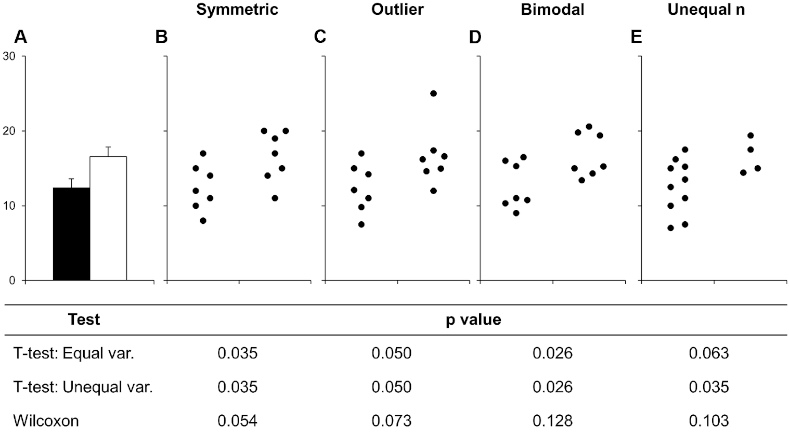

::: {.callout-note title="Learning outcomes & Chapter summary"}

1. **Visualize** frequencies and totals with bar charts, and numerical distributions with histograms.

2. **Explain** why bars showing only a mean or median can conceal important distributional information.

3. **Order** categorical bars and **choose** histogram bins that reveal the shape of a distribution.

:::



::: {.callout-note title="Further reading"}

- [Chapter 6 of Fundamentals of Data Visualization](https://clauswilke.com/dataviz/visualizing-amounts.html), on visualizing amounts.

:::

```{python}
#| label: summaries-python-setup
#| include: false

import altair as alt
import pandas as pd

alt.data_transformers.enable('vegafusion')
gm = pd.read_csv('https://raw.githubusercontent.com/joelostblom/teaching-datasets/main/world-data-gapminder.csv')
```

```{r}
#| label: summaries-r-setup
#| include: false

library(tidyverse)
theme_set(theme_gray(base_size = 18))
gm <- read_csv('https://raw.githubusercontent.com/joelostblom/teaching-datasets/main/world-data-gapminder.csv', show_col_types = FALSE)
```

## Bar charts

A bar chart is a good choice for representing summary statistics
such as counts of observations and summations
The reason for this is that for such data,
a single summary statistic can well describe it.
For example,
the height of a bar in a bar chart
can clearly communicate the number of people living in a country
at a specific point in time.
There is no missing information here
that we might need to communicate using another mark.

Bar charts are often avoided when visualizing summary statistics
such as the mean and median,
as the purpose of these summary statistics
is to describe a distribution.
However,
the mean and median only describe one aspect of a distribution
(the central tendency, meaning where most values are found).
Thus,
to graphically depict a distribution
we also need to illustrate the spread of the distribution
(the range of the values that were observed).
We will cover how to effectively visualize this later in the course.

Below is an example of this from a [scientific article on how to present data accurately](https://journals.plos.org/plosbiology/article?id=10.1371/journal.pbio.1002128).
The bars in A show the mean and standard error
of all the different set of points in the panels B-E.
This is an example of how bar charts could hide widely different data distributions,
which would lead to different interpretations of the experiment
both visually from looking at the points
and by examining formal statistical comparisons
(the table below the figure,
you don't need to know exactly what these are
just note how different they are from different distributions).



To learn how to create bar charts,
we will continue working with the Gapminder dataset introduced in [Trends](6_trends.qmd),
but look at values from only a single year, 2018.
First let's create a bar chart of a single value per country,
which represents the sum of all the countries' populations.

```{python}
#| label: gapminder-filter-2018
gm2018 = gm.query('year == 2018')
gm2018
```

::: {.callout-note}

Instead of `query`,
we could also use the standard pandas boolean indexing as shown below:

```python
gm2018 = gm[gm['year'] == 2018]
```

To filter for a date range,
we could do the following:

```python
gm[gm['year'].between(1987, 2018)]
```

or 

```python
gm.query("1987 <= year <= 2018")
```

:::

Finally let's create our first bar plot:

::: {.panel-tabset group="language"}

### Altair

```{python}
#| label: population-bars-alt
alt.Chart(gm2018).mark_bar().encode(
    x='region',
    y='sum(population)'
)
```

### ggplot

```{r}
#| label: population-bars-gg
gm2018 <- gm %>% filter(year == 2018)

ggplot(gm2018, aes(x = region, y = population)) +
    geom_bar(stat = 'summary', fun = sum)
```

:::

If we switched x and y,
we would create a horizontal bar chart instead.
Although vertical bar charts are more commonly seen,
horizontal bar charts are preferred
when the labels on the categorical axis
become so long that they need to be rotated
to be readable in a vertical bar chart.
Since this is the case for our plot
we will continue to use horizontal bar charts.

::: {.panel-tabset group="language"}

### Altair

```{python}
#| label: population-horizontal-alt
alt.Chart(gm2018).mark_bar().encode(
    x='sum(population)',
    y='region'
)
```

### ggplot

Flip x and y for a horizontal chart.

```{r}
#| label: population-horizontal-gg
ggplot(gm2018, aes(y = region, x = population)) +
    geom_bar(stat = 'summary', fun = sum)
```

:::

::: {.panel-tabset group="language"}

### Altair

To count values,
we can use the statistical function `count()`.
We don't need to specify a column name for the y-axis,
since we are just counting values in each categorical on the x-axis.

```{python}
#| label: country-counts-alt
alt.Chart(gm2018).mark_bar().encode(
    x='count()',
    y='region'
)
```

### ggplot

Remove `x` when counting
and use the `'count'` stat instead of `'summary'`.
Since there is only one way of counting
we don't need to specify a function
(there are many ways of summarizing: mean, median, sum, sd, etc).

```{r}
#| label: country-count-stat-gg
ggplot(gm2018, aes(y = region)) +
    geom_bar(stat = 'count')
```

ggplot discourages people from using bars for summaries,
so the default `stat` is actually `'count'`,
which means we can leave it blank.

```{r}
#| label: country-counts-gg
ggplot(gm2018, aes(y = region)) +
    geom_bar()
```

:::

By default the bars are sorted alphabetically
from top to bottom.
Unless the categorical axis has a natural order to it,
it is best to sort the bars by value.
This makes it easier to see any trends in the data,
and to compare bars of similar height more carefully.

::: {.panel-tabset group="language"}

### Altair

To sort the bars,
we will again use the helper functions `alt.X` and `alt.Y`,
this time with `.sort('x')`
to specify that we want to sort
according to the values on the y-axis.

```{python}
#| label: country-counts-sorted-alt
alt.Chart(gm2018).mark_bar().encode(
    x='count()',
    y=alt.Y('region').sort('x')
)
```

### ggplot

It is easy to reorder a column based on another existing column in ggplot,
but it is a little bit tricky to do it based on a non-existing column,
such as the count so we need to create a column for the count first.

`add_count` creates a column named `n`,
that we can then pass to the base R `reorder` function
as the sorting key for our categorical axis column:

```{r}
#| label: country-counts-sorted-gg
gm2018 %>%
    add_count(region) %>%
    ggplot(aes(y = reorder(region, n))) +
    geom_bar()
```

:::

When sorting by value,
it is often more visually appealing with the longest bar
the closet to the axis line of the measured value (the x-axis in this case),
as in the chart above (but this is somewhat subjective).
If we prefer the reverse the order,
we could use the minus sign before the axis reference.

::: {.panel-tabset group="language"}

### Altair

```{python}
#| label: country-counts-reversed-alt
alt.Chart(gm2018).mark_bar().encode(
    x='count()',
    y=alt.Y('region').sort('-x')
)
```

### ggplot

Reversing a sort is done with the minus sign like in Altair.

```{r}
#| label: country-counts-reversed-gg
gm2018 %>%
    add_count(region) %>%
    ggplot(aes(y = reorder(region, -n))) +
    geom_bar()
```

:::

Sometimes there is a natural order to our data
that we want to use for the bars,
for example days of the week.
Althogh our sort order in the plot above
is the best for this particular data,
let's demonstrate how we can change it.

```{python}
#| label: country-counts-custom-order
my_order = ['Africa', 'Europe', 'Oceania', 'Asia', 'Americas']
alt.Chart(gm2018).mark_bar().encode(
    x='count()',
    y=alt.Y('region').sort(my_order)
)
```

For situations like this,
we can pass a list or array
to the `sort` parameter.
We can either create this list manually as in this slide,
or use the pandas sort function if we wanted
for example reverse alphabetical order.

To learn more about good considerations
when plotting counts of categorical observations,
you can refer to [chapter 6 of Fundamental of Data Visualizations](https://clauswilke.com/dataviz/visualizing-amounts.html).

## Histograms

So far we have been counting observations in categorical groups
(the continents).
To make a bar chart of counts for a quantitative/numerical value
does not look that great by default.

::: {.panel-tabset group="language"}

### Altair

```{python}
#| label: life-expectancy-unbinned-alt
alt.Chart(gm2018).mark_bar().encode(
    x=alt.X('life_expectancy'),
    y='count()'
)
```

### ggplot

```{r}
#| label: life-expectancy-unbinned-gg
ggplot(gm2018, aes(x = life_expectancy)) +
    geom_bar()
```

:::

This is because a bar is plotted for each of the unique numerical values,
and our histogram would look very spiky as you can see in this slide.
This is because there are very few values that are exactly the same.

For example,
values like 67.2, 69.3, 69.5, etc,
would all get their own bar
instead of being in the same bar
representing the interval 65-70.
We can see this by using the handy interactive `tooltip`
encoding in Altair
while hovering over the bars

```{python}
#| label: life-expectancy-tooltip
alt.Chart(gm2018).mark_bar().encode(
    x=alt.X('life_expectancy'),
    y='count()',
    tooltip='life_expectancy'
)
```

To fix this issue,
we can create bins on the x-axis and count all those values together.
This way we can see how many observations
fall into numerical intervals on the x-axis
in an attempt to estimate the distribution, or shape, of the entire dataset.
This type of chart is so common that it has its own name: histogram.

::: {.panel-tabset group="language"}

### Altair

The first step we need to perform in Altair,
is to divide the axis into intervals,
which is called binning.
To enable binning of the x-axis in Altair,
we can set `bin=True` inside `alt.X`.
This automatically calculates a suitable number of bins,
and counts up all the values within each group
before plotting a bar representing this count.

```{python}
#| label: life-expectancy-histogram-alt
alt.Chart(gm2018).mark_bar().encode(
    x=alt.X('life_expectancy').bin(),
    y='count()'
)
```

### ggplot

We can change the `stat` from the default `'count'`
to `'bin'`.

```{r}
#| label: life-expectancy-bin-stat-gg
ggplot(gm2018, aes(x = life_expectancy)) +
    geom_bar(stat = 'bin')
```

Since this is so common,
there is a shortcut: `geom_histogram`.
This geom calls `geom_bar(stat = 'bin')` by default,
so the output will be exactly the same.

```{r}
#| label: life-expectancy-histogram-gg
ggplot(gm2018, aes(x = life_expectancy)) +
    geom_histogram()
```

Using `geom_histogram` is a bit more common,
so that is what I will use in the lecture notes,
but please remember that there is nothing magical with this function.
It is just `geom_bar` with a different default argument to `stat`.

:::

In contrast to bar charts,
it is rarely beneficial to make horizontal histograms
since the labels are numbers which don't need to be rotated to be readable.

We could bin the tooltip the same way.
Altair is very consistent,
so when you learn the building blocks,
you can use them in many places.

```{python}
#| label: histogram-bin-tooltip
alt.Chart(gm2018).mark_bar().encode(
    x=alt.X('life_expectancy').bin(),
    y='count()',
    tooltip=alt.Tooltip('life_expectancy').bin()
)
```

Although the automatically calculated number of bins is often appropriate,
it tends to be on the low side.
While to many bins make the plot look spiky,
having too few bins can hide the true shape of the data distribution.
We can change the number of bins by passing `alt.Bin(maxbins=30)`
to the `bin` parameter instead of passing the value `True`.

::: {.panel-tabset group="language"}

### Altair

```{python}
#| label: histogram-maxbins-alt
alt.Chart(gm2018).mark_bar().encode(
    x=alt.X('life_expectancy').bin(maxbins=30),
    y='count()'
)
```

### ggplot

Instead of setting binwidth as suggested,
we can use `bins` to set the number of bins,
which is more similar to `maxbins` in Altair.

```{r}
#| label: histogram-bins-gg
ggplot(gm2018, aes(x = life_expectancy)) +
    geom_histogram(bins = 20)
```

```{r}
#| label: histogram-borders-gg
ggplot(gm2018, aes(x = life_expectancy)) +
    geom_histogram(bins = 20, color = 'white')
```

:::

What is a good rule for how many bins there should be?
A guideline is that you want a histogram to accurately capture the underlying distribution
without introducing artifacts:

- Too wide bins can hide detail in the distribution,
  e.g. bimodality might not show up since a single bin covers both peaks.
- Too narrow narrow bins can suggest additional detail
  that is an artifact of the limited size of the sample
  and/or the exact arrangement of the bins.
  This often shows up as the histogram appearing to have multiple small spikes
  (note that there are case where multiple small spikes could indicate a true property of the distribution,
  e.g. a periodicity so it is important to think about this in the context of the specific dataset you are working with).

You also want to avoid unequal bin sizes,
since it would not be fair to compare the height of these,
and ideally have the bins line up nicely with the x-axis so that the interval the cover is easily identifiable.
In practice,
it is a good idea to experiment with a few different bin size to better understand the distribution of your data
and how to accurately present it.

Both Altair and ggplot uses an automatic rule to compute a suggested optimal number of bin,
which is usually quite good.
Altair then also snaps the bins to the same width as the x-axis ticks,
so that it is easy to read which interval they cover.
This snapping sometimes creates to wide bins
so you might need to increase the `maxbins` in Altair.
In ggplot,
you might occasionally want to create fewer bins than the default.

[This page has additional detail about bins widths
and examples of how histograms with too many and too few bins can look like](https://answerminer.com/blog/binning-guide-ideal-histogram).
