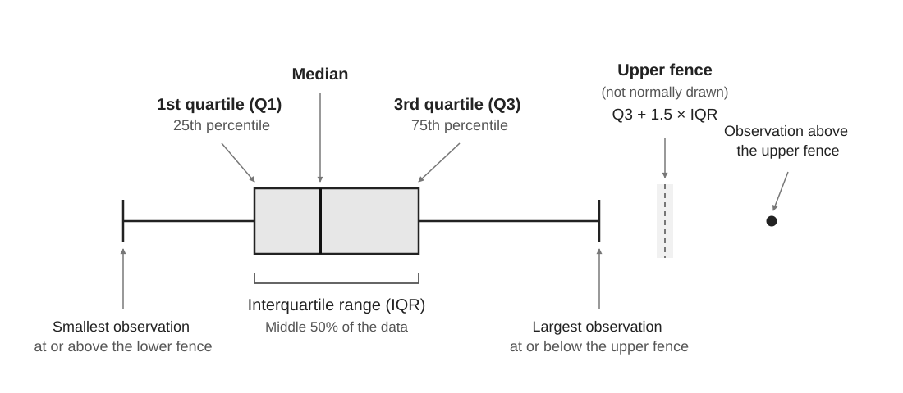
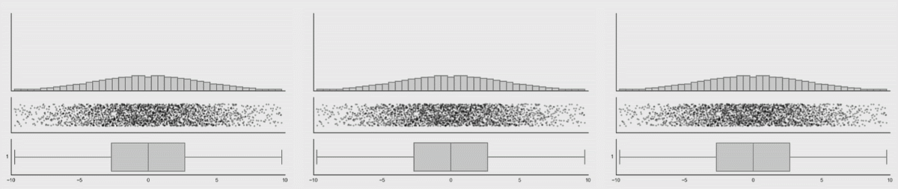



::: {.callout-note title="Learning outcomes & Chapter summary"}

1. **Visualize** measures of central tendency, such as means and medians, using statistical summaries.

2. **Show** variability with standard deviations, percentile intervals, and boxplots.

3. **Explain** what summaries can hide and **combine** them with the underlying observations using jittered points.

:::

## Why do we care?

In [Order](6_order.qmd), we connected supplied values to make their sequence clear.
Sometimes, however, our question concerns a collection of observations:
How many are there? What is their total? What is a typical value?
A summary helps answer these questions by reducing many values to a few.
In this chapter, we will explore how to reduce a collection
of observations to useful quantities—and ask what information that reduction leaves out.

That reduction is useful, but it also leaves information out.
As we work through this chapter, keep asking:
**What did we lose, and how much of it do we need to put back?**
We will explore those questions in the following chapters.


::: {.callout-default .ex-prompt}

Long term meditation has document effects
in terms of .... ref.
But what about if you have never meditaated before 
and just want to feel a bit less stressed about your next exam?
There was a paper that explored exactly that and here are the results
using the best practices we learned about grouping with position
and position on the same scale to compare values:

:::: {.panel-tabset group="language"}

<!-- TODO jitter here? -->
### Altair

```{python}
import pandas as pd
import altair as alt

meditation = pd.read_csv('data/meditation-stress-sample.csv')

alt.Chart(meditation).mark_point().encode(
    y='condition',
    x='stress'
)
```

### ggplot

```{r}
#| message: false
library(readr)
library(ggplot2)

# Sample to not saturate plots
meditation = read_csv('data/meditation-stress-sample.csv')
ggplot(meditation, aes(y = condition, x = stress)) +
    geom_point()
```

::::

What conclusions can you draw?

:::: {.callout-default .ex-hint}

Can you say anything at all


::::: {.callout-default .ex-solution}

Although we followed the best practices of what we learned so far,
we can't really draw any meaningful conclusions from this chart
since there are too many overlapping points.
Read on to find out what we could do to improve on this situation.

:::::

::::

:::

## Visualizing statistical summaries

Similar to what we learned in [Why visualize data?](1_why-visualize-data.qmd)
where we saw that collapsing data into a statistical summary
could make it easier to understand than a raw table of numbers.
We could employ a similar strategy here and 

::: {.panel-tabset group="language"}

### Altair

In Altair,
we can write [any aggregation
function](https://altair-viz.github.io/user_guide/encodings/index.html#encoding-aggregates)
such as mean, median, or sum
directly as a string
wrapping the column name,
e.g. `'median(stress)'`:


```{python}
alt.Chart(meditation).mark_point().encode(
    y='condition',
    x='mean(stress)'
)
```

### ggplot

In ggplot,
we can tell each geom to use a summary statistics
instead of the raw observation values.
We then also need to specify which kind of summary,
which can be any aggregate function, such as `mean`, `median`, `sum`, etc
(when we don't specify any explicit value to `stat`,
the default is `'identity'`, i.e. the raw values):

```{r}
ggplot(meditation, aes(y = condition, x = stress)) +
    geom_point(stat = 'summary', fun = mean)
```

Instead of calling the `geom_point` function and define the `stat` parameter,
we could call the `stat_summary` function and define the `geom` parameter:

```{r}
#| output: false
ggplot(meditation, aes(y = condition, x = stress)) +
    stat_summary(geom = "point", fun = mean)
```

These two approaches are **identical** in terms of functionality
and both are commonly used.
Sticking with the `geom_` approach makes the code syntax more consistent,
regardless of whether we are plotting the raw identity value, or summaries.
[This is a nice SO answer if you want to know
more](https://stackoverflow.com/questions/38775661/what-is-the-difference-between-geoms-and-stats-in-ggplot2/44226841#44226841).

::::

::: {.column-margin}

<br><br>
**To include 0 or not**
As you can see,
different packages make different decision about whether to include the 0 by default.
Whether you should include it depends on whether
you want to emphasize the differences between groups or not,
which we will discuss more later.

:::

Now we can clearly see
that **on average** there are some differences between the groups.

## Visualizing spread

But including the mean value completely remove all the variability.
This is not a good idea
because how the individual data points are distributed
also impacts which conclusions we can draw from the data.

So,
whenever we show a measure of central tendency such as the mean or median,
it is could to couple it with an indication of the underlying variability.

Variability comes in two flavors,
we can either talk about the spread of the underlying data (descriptive statistics)
or the uncertainty in the estimate of central tendency (inferential statistics).
These two types of variability answers two different question,
but graphically they are often depicted similarly.
In this chapter,
we will focus on how spread out the underlying data distribution is,
and come back to confidence intervals and similar inferential variability measures
in a future chapter.
<!-- TODO which chapter for ci, link to it and include more discussion around bootstrap there? and also talk about how more points changes the interval to become smaller -->
<!-- TODO mention error bar -->

One measure of the spread in the underlying data
is the [standard deviation](https://en.wikipedia.org/wiki/Standard_deviation),
which quantifies how far a typical observation is from the mean
(technically the standard deviation is the [root mean squared distance](https://en.wikipedia.org/wiki/Root_mean_square_deviation)).
Let's see how we can include the standard deviation
together with the mean
in our charts:

::: {.panel-tabset group="language"}

### Altair

The `errorbar` mark allows us to plot different common
measures of variability,
including the standard deviation.
We're changing the color of the point marks to match the error bar.
We are using `mark_circle`
as a shortcut for `mark_point(filled=True)`.

```{python}
points = alt.Chart(meditation).mark_circle(color='black').encode(
    y='condition',
    x='mean(stress)'
)

points + points.mark_errorbar(extent='stdev')
```

### ggplot

Like the name implies,
the `pointrange` geom creates both a point and a range.
Previously we have passed specific statistic summary functions to the `fun` parameter,
but here we will use `fun.data` because we need both the lower and upper bond
of where to plot the line for the standard deviation range.
Whereas `fun` only allows functions that return a single value
which decides where to draw the point on the y-axis
(such as `'mean'`),
`fun.data` allows functions to return three values (the min, middle, and max y-value).

The `fun.args` parameter looks a bit cryptic.
What it does is to pass `mult = 1` (multiplier) to the `mean_sdl` function,
which otherwise multiplies the standard deviation by 2 by default.

```{r}
ggplot(meditation, aes(y = condition, x = stress)) +
    geom_pointrange(stat = 'summary', fun.data = mean_sdl, fun.args = list(mult = 1))
```

Note that you need the `Hmisc` package installed in order to use `mean_sdl`;
if you don't nothing will show up but you wont get an error,
so it can be tricky to realize what is wrong.

:::

This give us some additional information:
we can see that all the conditions
had a similar spread in the underlying data.
While pairing a mean with an indication of its standard deviation
is better than just showing a mean alone,
it is not a satisfactory visualization in most cases.
Just as we learned about statistical summaries of raw numbers in the first chapter
graphical statistical summaries don't tell the whole story.
Let's explore that more in this exercise.

::: {.callout-default .ex-prompt}

To the left,
we can see the mean + standard deviation
of a set observations.
To the right,
there are four different suggestions
for what these underlying observations might look like.
By studying this chart,
which of the sets of possible underlying observation
do you think was used to create the summary chart to the left?

```{python}
#| echo: false
#| label: fig-summary-sd-obs
#| fig-cap: Underlying distributions for mean and standard deviation. Adapted from [Beyond bar and line graphs](https://journals.plos.org/plosbiology/article?id=10.1371/journal.pbio.1002128).

SCENARIOS = ['Symmetric', 'Outlier', 'Bimodal', 'Unequal n']
data = pd.read_csv('data/same_mean_sd.csv').query('dataset.isin(@SCENARIOS)')
y = alt.Y('value:Q').title('Value').scale(domain=[0, 40]).title(None)
base = alt.Chart(data, height=200, width=alt.Step(44)).encode(
    alt.X('group').title(None).axis(labelAngle=0),
    alt.Color('group:N').legend(None)
)

intervals = base.mark_errorbar(extent='stdev', thickness=2).encode(y=y)
means = base.mark_point(filled=True, size=60).encode(y=y.aggregate('mean')).properties(
    title=alt.Title('Mean + SD', fontSize=12)
)
summaries = (
    (intervals + means).transform_filter(alt.datum['dataset'] == 'Symmetric')
)

observations = (
    base
    .transform_calculate(jitter=alt.expr.random())
    .mark_circle(size=30)
    .encode(y=y, xOffset=alt.XOffset('jitter:Q').scale(domain=(0, 1.5)))
    .facet(column=alt.Column('dataset:N').sort(SCENARIOS).title('Possible underlying observations'))
)
alt.hconcat(summaries, observations, spacing=30)
```

:::: {.callout-default .ex-hint}

It's more than just one of them...

::::: {.callout-default .ex-solution}

In this case,
**all** of the four distributions above
gave rise to the same summary chart!
That means if that you only look at the summary chart with the mean + SD,
you don't really have any idea what your data looks like.
This matters because depending on what your observations look like,
you will come to different conclusions.
For example,
in the case of the outlier,
maybe that's a technical error
and the average between the two groups
would be the same without that one point?
Or what if group A follows a symmetric distribution
whereas group B shows a bimodal spread?

Note that in the case of the bimodal distribution of observations
we should ask ourselves whether it is at all useful
to include a mean.
Maybe we should skip it all since none of the observations
are actually close to the mean
and the mean therefore does not tell us much
about the underlying observations.
In this case it would be more helpful
to talk about the two clusters
instead of trying to represent all the observation
with a single average value.
<!-- TODO consider including an example with e..g the geyser eruption at old faithful to drive this home further -->

:::::

::::

:::

## Including the underlying observations

To avoid being misled by a lone summary statistic,
we can show the underlying observations of each group
together with the statistical summaries.
When doing this,
it can help to "jitter" the observations
so that they 

Another caution when using position for grouping, is that plotting data points along a single axis can lead to overlap. That's where **jittering** comes to the rescue. Jittering introduces slight variation, or 'jitter', in the position of data points in each lane, making them easier to see. 

::: {.column-margin}

**Jitterbug**

Back in the 1930s, the jitterbug was a lively, often wild, dance style that matched the fast-paced, unpredictable energy of swing music. In data visualization, jittering serves a similar purpose: to add a touch of randomness to points in a plot.


:::

::: {.panel-tabset group="language"}

### Altair

<!-- TODO explain this and the r code below. How much depends on what I introdude earlier for altair -->
```{python}
base = alt.Chart(meditation, height=alt.Step(30)).encode(
    y=alt.Y('condition').scale(padding=0.4),
    x='stress'
)

points = (
    base
    .transform_calculate(jitter=alt.expr.random())
    .mark_circle(color='lightgrey')
    .encode(
        yOffset=alt.YOffset('jitter:Q'),
        x='stress'
    )
)

points + base.mark_errorbar(extent='stdev', thickness=1.5) + base.mark_circle(size=40, color='black').encode(x='mean(stress)')
```

### ggplot

```{r}
ggplot(meditation, aes(y = condition, x = stress)) +
    geom_point(position = 'jitter', color = 'grey') +
    geom_pointrange(stat = 'summary', fun.data = mean_sdl, fun.args = list(mult = 1))
```

As a shortcut for jittered points
you could also use the specialized geom `geom_jitter()`.

:::

## Showing medians with boxplots

What about if we visualize the median instead of the mean?
Showing the median can especially useful
when there are a few extreme values in the data
since these impact the mean more than the median,
and the median thus becomes a more helpful indication
of the representative observation.
But this decision is context dependent:
if we are interested in these extreme values,
then they should probably have a big impact
on the measure of central tendency
that we choose to show.
Therefore,
it is often a good idea to show means and medians together,
since they tell us difference things about the population.

A common measure for distribution spread
that is used together with medians,
is a percentile interval,
which shows all the data
between the chosen percentiles
(as a point of reference,
one standard deviation
is the equivalent of a ~68% percentile interval
in a normally distributed data set).

The most common way to show median plus a percentile interval is via a boxplot.
This illustration can help you interpret the different parts of the box:

{#fig-boxplot-anotomy}


::: {.panel-tabset group="language"}

### Altair

```{python}
alt.Chart(meditation).mark_boxplot().encode(
    y='condition',
    x='stress'
)
```

### ggplot

```{r}
ggplot(meditation, aes(y = condition, x = stress)) +
    geom_boxplot()
```

:::

Although boxplots show multiple percentiles,
they still hide important information about the underlying observations
and should therefore also ideally be used
together with a plot of the underlying observations
or as a concise summary of the data
after having inspected the underlying observations ourselves.

::: {#fig-boxplot-drawbacks}

{#fig-boxplot-multimodal}

This illustration from [Autodesk
Research](https://www.autodesk.com/research/publications/same-stats-different-graphs)
show how boxplots look the same even when the distribution of the underlying observations changes drastically.

:::

::: {.callout-warning }

## Avoid drawing conclusions from looking at summary charts alone

Summary charts like mean + SD are boxplots are useful
since aggregation reduces the complexity of the chart.
But even if you are interested
in comparing group summaries such as means or medians,
you should always also inspect the underlying observations
to understand how they are distributed and if there are any outliers in the data,
since this will impact which conclusions you can derive from the chart.

:::

## What conclusions *can* we draw from the data?

It is important to note that we can not draw any
conclusions around the statistical significance of the differences we see here.
We haven't performed any statistical tests
or plotted any elements that can be used for inference
such as confidence intervals.
So we cannot say anything about how likely it is that we would observe
these results out of random chance, 
even if there was no difference between the groups.

What about the magnitude of the change?
It seems like the difference between the meditation conditions
and the book reading is about 0.25 units.
Is that a lot or a little?
One way to see it is that it is a difference of 
To comment on that we would need to know more about the domain
that the results from 
<!-- TODO include conclusions from paper and more reasonong -->

## Counts

Another useful statistics we can compute
is the counts of observations in each group.

::: {.panel-tabset group="language"}

### Altair

```{python}
alt.Chart(meditation).mark_point().encode(
    y='condition',
    x='count()'
)
```

### ggplot

```{r}
ggplot(meditation, aes(y = condition)) +
    geom_point(stat = 'count')
```

:::

When we are showing an accumulated value like a count or sum,
it can be beneficial to replace our point mark
with a bar
to be able to more clearly compare groups.
The bar is drawn from zero 
and thus makes the accumulated amount explicit through its length
(you can think of the bar as stacking all the observation on top of each other).

::: {.panel-tabset group="language"}

### Altair

```{python}
alt.Chart(meditation).mark_bar().encode(
    y='condition',
    x='count()'
)
```

### ggplot

```{r}
ggplot(meditation, aes(y = condition)) +
    geom_bar(stat = 'count')
```

Since there is only one way of counting
we don't need to specify a function
(there are many ways of summarizing: mean, median, sum, etc).
ggplot discourages people from using bars for summaries,
so the default for `geom_bar` is actually `stat = 'count'`,
which means we could have written just `geom_bar()` above
to get the same result.

:::

::: {.callout-warning}

### Avoid bar charts for mean and median

Remember that the length of the bar suggests
that we started at zero and added something up,
e.g. the count or sum of observations.
Using bars for means have also been observed to
bias people to thinking that the 
distribution of points are more likely to lie 
withing the graphical region of the bar[^https://link.springer.com/article/10.3758/s13423-012-0247-5]
:::

### Sorting groups

In our chart above,
the groups on the y-axis are sorted in alphabetical order.
To make it easier to see which group has the most observation
and compare groups with similar amounts of observations
and highlight those that have the most and least observations,
we can instead sort by the count.

::: {.panel-tabset group="language"}

### Altair

The `sort()` method takes the name of another
visual channel to sort by,
such as `'x'`, `'color'`, etc.

```{python}
alt.Chart(meditation).mark_bar().encode(
    y=alt.Y('condition').sort('x'),
    x='count()'
)
```

Generally,
it tends to be a bit more visually appealing
to have the largest bar the closest to the value axis as above.
This is not a hard rule however,
and we can reverse the order by passing `'-x'` instead of `'x'`.

### ggplot

The base R function `reorder`
can be used to sort a column
based on another existing column,
e.g. `reorder(column_to_sort, column_to_use_as_sorting_order)`.
It requires an extra step to do it based on a non-existing column,
such as the count.
Here,
we use `add_count` to first create a column (automatically named `n`),
as the sorting key for our x-axis column:

```{r}
meditation |>
    dplyr::add_count(condition) |>
    ggplot(aes(y = reorder(condition, n))) +
        geom_bar()
```

Generally,
it tends to be a bit more visually appealing
to have the largest bar the closest to the value axis,
which we can achieve with `reorder(condition, -n)`.
This is not a hard rule however.

:::

This advice generally applies too all types of charts,
such as when showing points for means etc.
One exception is 
Unless there is a natural order to the data 

### Stacked bars

Similar to area charts
bar charts can also show multiple groups
as segments stacked on top of each other.
Let's learn how  that more in this exercise:

::: {.callout-default .ex-prompt}


For example,
we might be interested in how the participants of the survey
self-reported their gender.

::: {.panel-tabset group="language"}

### Altair

```{python}
alt.Chart(meditation).mark_bar().encode(
    y='condition',
    x='count()',
    color='gender'
)
```

### ggplot

```{r}
ggplot(meditation, aes(y = condition, fill = gender)) +
    geom_bar()
```

:::

In this chart,
it is easy to see that
all conditions have more female than male respondents.
But if we are trying to figure out which 
Is it also easy to see which had the most male and female respondents?
Why and what could we do to make this difficult comparison easier?

:::: {.callout-default .ex-hint}

The reason that the counts of males are hard to compare between conditions
is the same as for stacked areas.
But the solution is slightly different
since we have more options than just layering the bars on top of each other.

::::: {.callout-default .ex-solution}

It is difficult to compare the counts of male respondents
because the corresponding bar segments do not share a common baseline.
This means that we are left trying to mentally align the bars
to compare their lengths in our mind.
This is much harder than
simply reading a value of the x-axis for the 

We could switch to a point mark,
just as we switched from areas to lines to solve a similar problem,
but there is one more solution available to use for bars
that were not there for areas,
we can put the bars next to each other:

::: {.panel-tabset group="language"}

### Altair

The `yOffset`/`xOffset` encodings
that we used for jittering
can also take a categorical variable
to offset groups next to each other.

```{python}
alt.Chart(meditation).mark_bar().encode(
    y='condition',
    x='count()',
    color='gender',
    yOffset='gender'
)
```

### ggplot

The `position` parameter
that we used for jittering
can also take the `'dodge'` value,
which means that the geoms should "dodge"
stacking on top of each other
and be place next to one another instead.

```{r}
ggplot(meditation, aes(y = condition, fill = gender)) +
    geom_bar(position = 'dodge')
```

Now it is easy to see which condition had the most male participants too!

:::

:::::

::::

:::

::: {.callout-warning}

### Avoid stacked bar charts when exact group comparisons matter

Just like for stacked areas,
it is difficult to compare the bar segments
that do not share a baseline,
since we have to rely on their length
rather than the position of the top of the bars on the same axis.
We should therefore only use stacked bars
if the total (e.g. the total count per condition)
is of primary importance
and the comparisons between the groups
is of secondary importance.

:::

## Proportions

Proportions (and percentages) can be shown in similar ways as counts
but normalized to a whole.

::: {.panel-tabset group="language"}

### Altair

```{python}
alt.Chart(meditation).mark_bar().encode(
    y='condition',
    x=alt.X('count()').stack('normalize'),
    color='gender'
)
```

We could change the displayed axis values
from percentages to proportions
by formatting the labels of the axis as 1 decimal floats (`.1f`):

```{python}
alt.Chart(meditation).mark_bar().encode(
    y='condition',
    x=alt.X('count()')
    .stack('normalize')
    .axis(labelExpr=alt.expr.format(alt.datum.value, '.1f')),
    color='gender'
)
```

<!-- TODO change to    .axis(format='.1f'), -->

### ggplot

```{r}
ggplot(meditation, aes(y = condition, fill = gender)) +
    geom_bar(position = 'fill')
```

We could change the displayed axis values
from proportions to percentages
by specifying that the scale labels are percentages:

```{r}
ggplot(meditation, aes(y = condition, fill = gender)) +
    geom_bar(position = 'fill') +
    scale_x_continuous(labels = scales::label_percent())
```

:::


When we show proportions in a stacked bar chart
with only two groups,
both groups are easy to compare since the second group
(i.e. the male group above)
also share a common baseline at the top of the scale
(i.e. where the proportion is 1 to the right).
A third group would however be difficult to compare 
since it would be a floating segment in the middle
of the bars without a common baseline.

Proportional bars can also be put next to each other

For proportions,
it is also 

Based on these results we can see there were mostly females

