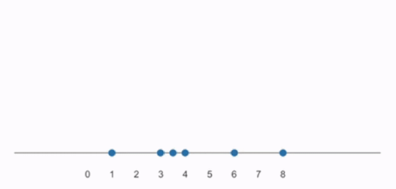

# Binned distributions {#sec-binned-distributions}



::: {.callout-note title="Learning outcomes & Chapter summary"}

1. **Construct** histograms by dividing a quantitative variable into bins and counting the observations in each interval.

2. **Evaluate** how bin width and placement affect the patterns visible in a histogram.

3. **Combine** histograms with rug plots to inspect the underlying observations.

4. **Compare** distributions across groups using overlapping histograms or facets with common bins and scales.

:::

<!-- TODO A histogram deep dive could explain how automatic bin-width selection rules work. -->

<!-- TODO Consider changing from maxbins and bins to step and binwidth to encourage thinking in units of the data and avoid implying that maxbins sets an exact bin count. -->

## Why bother?

In @sec-summaries,
we learned that it is important to inspect the underlying observations
to see how they are distributed.
Much of that information would be hidden if we looked only at a summary like the mean or median.
But what happens when we have too many data points
to visualize all of them individually?


::: {.callout-default .ex-prompt}

In this chart,
there are so many observations
that the plot is saturated
and it is difficult to tell
how the data points are distributed.
How do you think we could plot the observations
to more clearly see how they are distributed?

```{python}
#| label: runtime-jitter-motivation
#| echo: false
import altair as alt
import pandas as pd

# alt.datasets.data.movies().query("`Major Genre`.isin(['Comedy', 'Horror', 'Adventure', 'Drama'])").dropna(subset=['Running Time min']).to_csv('data/movies.csv')
movies = pd.read_csv('data/movies.csv')
alt.Chart(movies).mark_circle().encode(
    x='Running Time min',
    y='Major Genre',
    yOffset='jitter:Q',
).transform_calculate(
    jitter=alt.expr.random()
)
```

:::: {.callout-default .ex-hint}

We could, of course, increase the size of the chart
to jitter the points more,
but it would still be difficult
to get an overall idea of how the observations are distributed.
What if we could use what we learned
in the previous chapter about counting
to help us here?

::::: {.callout-default .ex-solution}

Instead of showing each individual observation,
we could visualize the counts of observations
within intervals (or "bins") of the quantitative variable on the x-axis.
Conceptually, we could think of this
as first creating bins along the x-axis
(for example, one bin could include runtimes from 80 up to, but not including, 100 minutes),
then counting all the observations that fall within each bin,
and finally drawing a bar
with a height corresponding to the count of observations.
This type of chart is called a histogram.

:::::

::::

:::

<!-- TODO Consider a shared theme with a lower height for all figures in this chapter. -->

## How to create histograms

The histogram creation process we described above
can be viewed in this animated schematic:

{#fig-hist-buildup}

Binning is useful because observations of a continuous or finely measured variable
may rarely have **exactly** the same value.
Counting each distinct value separately can produce a spiky, sparse chart.
Grouping nearby values into intervals helps us see broader patterns.

We could create the intervals manually in the dataframe
and plot a categorical count chart
as in the previous chapter,
but there is a special type of chart to help us
create the bins and counts for a quantitative variable:
the histogram.

Let's create a histogram for the entire dataset first,
before breaking it down into the different movie genres.

::: {.panel-tabset group="language"}

### Altair

VegaFusion makes it easier to work with large datasets in Altair
by precomputing supported data transformations in Python.
Altair's default data transformer limits inline datasets to 5,000 rows;
VegaFusion is one way to work with larger datasets, such as the marathon example later in this chapter.
It also works with smaller datasets
([read more about VegaFusion in the Altair documentation](https://altair-viz.github.io/user_guide/large_datasets.html#vegafusion-data-transformer)).

```{python}
#| label: runtime-histogram-alt-setup
import altair as alt
import pandas as pd

alt.data_transformers.enable('vegafusion')
```

We can use the `bin()` method
on the `alt.X` or `alt.Y` helper class
to divide the quantitative variable into intervals along that axis.
A distribution chart that is wider than it is tall
is often more visually appealing
and can make the distribution shape easier to follow,
so we use a compact chart height here.

```{python}
#| label: runtime-histogram-alt
movies = pd.read_csv('data/movies.csv')
alt.Chart(movies, height=150).mark_bar().encode(
    x=alt.X('Running Time min').bin(),
    y='count()',
)
```

The small gaps between the bars make it easier to distinguish individual bins.
If we wanted to,
we could show the histogram
as one connected graphical unit,
which can sometimes make it less messy
to compare multiple histograms in the same chart.

```{python}
#| label: runtime-histogram-color-alt
alt.Chart(movies, height=150).mark_bar(binSpacing=0).encode(
    x=alt.X('Running Time min').bin(),
    y='count()',
)
```


### ggplot

We can use `stat = 'bin'` to divide the quantitative variable into intervals
and count the observations in each one.
A chart that is wider than it is tall can make the distribution easy to follow,
so this chapter uses a compact default figure height.

```{r}
#| label: runtime-histogram-gg
#| message: false
library(ggplot2)

movies <- readr::read_csv('data/movies.csv', show_col_types = FALSE)
ggplot(movies, aes(x = `Running Time min`)) +
    geom_bar(stat = 'bin')
```

As a shortcut for `geom_bar(stat = 'bin')`,
we could use `geom_histogram()`,
which we will do from now on.

Showing the histogram
as one connected graphical unit, as above,
can sometimes make it less cluttered
to compare multiple histograms in the same chart,
but separating the bars makes it easier to distinguish individual bins.
Here, adding `color = 'white'` draws white outlines around the bars,
creating the appearance of gaps between them without changing the bin boundaries.


```{r}
#| label: runtime-histogram-color-gg
#| message: false
library(ggplot2)

ggplot(movies, aes(x = `Running Time min`)) +
    geom_histogram(color = 'white')
```

:::

Histograms make counts within intervals explicit
and they are easy to understand and explain,
but their appearance depends heavily
on how we choose those intervals.

## Bin properties

Different visualization libraries use different rules
to choose bin widths and boundaries.
Some favor round-number boundaries, while others start from a requested number of bins.
Regardless of which library you use,
it is a good idea to try several settings:
different features of the distribution can stand out at different bin widths.
For a given data range, requesting more bins generally produces narrower intervals.

::: {.panel-tabset group="language"}

### Altair

We can pass `maxbins=` to the `bin()` method
to request a maximum number of bins rather than an exact count.
The binning algorithm favors easy-to-read intervals
(for example, 5–10 instead of 6.3–9.4),
so different `maxbins` settings can sometimes produce the same bins.

```{python}
#| label: runtime-histogram-bins-alt
alt.Chart(movies, height=150).mark_bar().encode(
    x=alt.X('Running Time min').bin(maxbins=30),
    y='count()',
)
```

### ggplot

We can pass `bins` to `geom_histogram()`
to request a number of bins.
Here, we request 10 instead of the default 30:

<!-- TODO dropna in data? -->

```{r}
#| label: runtime-histogram-bins-gg
#| message: false
ggplot(movies, aes(x = `Running Time min`)) +
    geom_histogram(bins = 10, color = 'white')
```

:::

::: {.callout-default .ex-prompt}

Here we have created a few histograms for a dataset
containing finish times from the 2023 London Marathon
for male runners aged 18–39.
Explore different requested bin counts
using the dropdown widget below.
Which do you think is the "right" number of bins?
How would you explain the peaks that become visible
when the bins are narrower?

```{python}
#| label: marathon-histogram-bins
#| echo: false
mara = pd.read_csv('data/london_marathon_finish_times.csv')

bins = [20, 40, 80, 220]
bins_param = alt.param(
    name="bins_param",
    value=20,
    bind=alt.binding_select(options=bins, name='Max bins (requested): ')
)

layers = [
    alt.Chart(mara, height=150)
    .transform_filter(f"bins_param === {n}")
    .mark_bar()
    .encode(
        x=alt.X(
            "Time (minutes)",
            bin=alt.Bin(maxbins=n),
            title="Finish time (minutes)"
        ),
        y=alt.Y("count()", title="Count"),
        tooltip=alt.Tooltip('Time (minutes)').bin(maxbins=n),

    )
    for n in bins
]

alt.layer(*layers).add_params(bins_param)
```

To switch more quickly between the options,
you can use the arrow keys
after clicking the dropdown once.
You can also hover over a bar with the pointer
to see the exact values for that interval.

:::: {.callout-default .ex-hint}

It seems like the peaks are
just before the round numbers 180, 210, and 240 min.
How many hours do these minute values correspond to?

::::: {.callout-default .ex-solution}

In this case,
the peaks are not a binning artefact or technical noise;
they reflect a real phenomena in the underlying data.
These concentrations in finish times
occur just before round-numbers,
consistent with runners aiming to finish below a target time.
Popular targets include 3 hours, 3 hours 30 minutes, and 4 hours,
which correspond to 180, 210, and 240 minutes.^[[Reference-Dependent Preferences: Evidence from Marathon Runners](https://doi.org/10.1287/mnsc.2015.2417)]
Trying several bin widths helps us check whether these concentrations persist
rather than trusting a peak that appears with only one binning choice.

:::::

::::

:::

::: {.callout-warning}

### Avoid looking at just a single histogram

Various attributes of the distribution
can stand out at different bin widths.
It is therefore important
to try a few different bin widths
and reflect on which features of the underlying data
they might highlight.

:::

Bin width is not the only choice that affects a histogram's appearance.
Even histograms with the same bin width can look quite different
when their boundaries are shifted along the x-axis.
In @fig-hist-bin-shift,
we can see that the left histogram
seems to show a long-tailed distribution,
but when the bins are shifted over in the rightmost histogram,
it now looks like a potentially bimodal distribution
with two peaks.

```{python}
#| echo: false
#| label: fig-hist-bin-shift
#| fig-cap: >
    #| The same data has been used to create these two histograms,
    #| which also share bin width.
    #| The only difference is that
    #| the start and end points of the bins
    #| are shifted slightly between the two charts.
    #| This figure is just for illustrative purposes
    #| so we have kept the variable name of the axis.

from random import Random

cars = alt.datasets.data.cars().copy()
rng = Random(4239402)
bin_min = 235
bin_max = 285

mask_to_replace = cars['Displacement'].between(bin_min, bin_max)
new_values = [rng.choice(range(bin_max, 300)) for _ in range(mask_to_replace.sum())]
cars.loc[mask_to_replace, 'Displacement'] = new_values

hist = alt.Chart(cars, height=120, width=200).mark_bar().encode(
    alt.X('Displacement').bin(step=50).title(None).scale(domain=(20, 500)),
    alt.Y('count()').title(None)
)
tick_values = list(range(0, 500, 50))
hist | hist.encode(
    alt.X('Displacement')
    .bin(step=50, nice=False, extent=[35, 490])
    .title(None)
    .scale(domain=(20, 500))
    .axis(
        labelExpr=(
            f"indexof({tick_values}, datum.value - 35) % 2 === 0"
            " ? datum.label : ''"
        ),
    ),
)
```

## Adding back individual observations

The histogram shortcomings we have learned about
can be somewhat alleviated
by showing individual observations alongside the histogram.
We can use jittered points, as at the start of the chapter,
or we can use a small tick to mark each observation
in what is often called a "rug" plot.
We have already covered the downsides
of visualizing all individual observations,
such as overlap that can saturate the chart.
Even so, individual marks often complement a histogram well.

::: {.panel-tabset group="language"}

### Altair

We create the tick mark as a separate chart
that we then concatenate vertically with the histogram
using the operator `&`.
We also indicate that the scale of the x-axes
should be shared between the two charts
so that the ticks align with the histogram
and it is easy to see which observations
belong to which bin.

```{python}
#| label: runtime-histogram-rug-alt

hist = alt.Chart(movies, height=150).mark_bar().encode(
    x=alt.X('Running Time min').bin(maxbins=20),
    y='count()',
)

rug = alt.Chart(movies).mark_tick().encode(
    x=alt.X('Running Time min'),
)

(hist & rug).resolve_scale(x='shared')
```

### ggplot

We could have created a separate chart
with the individual observations
that we concatenated vertically
with the histogram.
But there is also `geom_rug()`,
which makes this a bit more convenient
by plotting the individual observations
directly in the margin of the canvas.

```{r}
#| label: runtime-histogram-rug-gg
ggplot(movies, aes(x = `Running Time min`)) +
    geom_histogram(color = 'white') +
    geom_rug()
```

:::

## Multiple distributions

With all that we have learned about histograms in mind,
let's finally create a version of the plot we started this chapter with,
using histograms rather than jittered points.

::: {.callout-warning}

### Avoid too many histograms in the same chart

You might be tempted to simply group the histograms using color
in the same chart,
but it easily becomes difficult
to separate the histograms visually
so it is not an effective way to visualize
distributions,
as you can see in this chart.

<!-- TODO deep dive into frequency polygons -->

::: {.panel-tabset group="language"}

### Altair

Since bars stack on top of each other by default,
we need to set `stack(False)` on the y-axis,
so that they all share a common baseline.
To be able to see the bars
behind each other,
we make them partially transparent by setting `opacity=0.5`.

```{python}
#| label: genre-histograms-overlaid-alt
alt.Chart(movies, height=150).mark_bar(opacity=0.5).encode(
    x=alt.X('Running Time min').bin(maxbins=30),
    y=alt.Y('count()').stack(False),
    color='Major Genre',
)
```

### ggplot

Since bars stack on top of each other by default,
we need to set `position = 'identity'`,
so that they all share a common baseline.
To be able to see the bars
behind each other,
we make them partially transparent
with the `alpha` parameter.


```{r}
#| label: genre-histograms-overlaid-gg
ggplot(movies, aes(x = `Running Time min`, fill = `Major Genre`)) +
    geom_histogram(color = 'white', position = 'identity', alpha = 0.5)
```

:::

One exception to this rule is
if the distributions are well-separated along the axis,
or there are only two (or maybe three)
distributions in the chart;
then a colored histogram chart can be effective.


```{python}
#| label: two-genre-histograms-alt
#| echo: false
(
    alt.Chart(
        movies
        .query('`Major Genre`.isin(["Comedy", "Drama"])')
        .sort_values("Major Genre"),
        height=150
    )
    .mark_bar(opacity=0.5)
    .encode(
        x=alt.X('Running Time min').bin(maxbins=30),
        y=alt.Y('count()').stack(False),
        color='Major Genre',
    )
)
```


:::

A more effective way
to visualize multiple distributions as histograms
is to place each movie genre in a separate facet.
Since we are interested in comparing
the distributions across genres,
we create all facets in a single column,
which aligns their x-axes
and facilitates seeing shifts in the distributions
between genres.
Use the same bin boundaries and axis scales across facets to make those comparisons meaningful.

::: {.panel-tabset group="language"}

### Altair

```{python}
#| label: genre-histograms-faceted-alt
alt.Chart(movies, height=80).mark_bar().encode(
    x=alt.X('Running Time min').bin(maxbins=30),
    y='count()',
).facet(
    'Major Genre',
    columns=1
)
```

### ggplot

```{r}
#| label: genre-histograms-faceted-gg
#| fig-height: 6
ggplot(movies, aes(x = `Running Time min`)) +
    geom_histogram(color = 'white') +
    facet_wrap(vars(`Major Genre`), ncol = 1)
```

:::

Now we can detect differences
that we couldn't see in the original jittered point plot.
For example, adventure movies span a broad range of runtimes,
whereas comedies tend to be more tightly concentrated.
