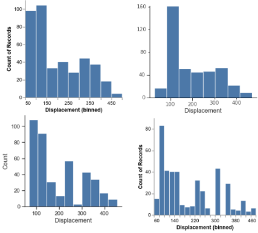
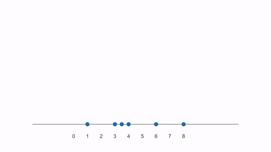

::: {.callout-note title="Learning outcomes & Chapter summary"}

1. **Visualize** distributions with density plots and **explain** how they are constructed and how they differ from histograms.

2. **Select** an appropriate distribution plot based on its strengths and limitations.

3. **Create** density plots to compare a few distributions, controlling bandwidth, grouping, transparency, and count scaling.

:::

**The motivation for this chapter should be what to do when there are too many points to show all observations**

One summary value can hide important differences between collections of observations.
An interval adds information about their variability, or about uncertainty in an estimate,
but its endpoints still do not show where observations or probability are concentrated.
Two distributions can have similar centers and interval widths yet very different shapes.

Building on the discussion of variability in [Summaries](7_summaries.qmd)
and the histograms in [Counts](8_counts.qmd),
we now ask: **How can we see where values are concentrated, where there are gaps,
and whether there is more than one cluster?**
We now explore how density plots reveal the shape of a distribution
and compare their strengths and limitations with histograms.



::: {.callout-note title="Further reading"}

- [Video on how distribution plots are created](https://ubcca-my.sharepoint.com/:v:/g/personal/joel_ostblom_ubc_ca/EXwcQii5i9lOgtST81EdRuoBF_Oq3j7zRxCgEybba5BENQ?e=e2fZNu) (30 minutes; CWL login required; the first minute is intentionally blank).
- [Chapter 7 of Fundamentals of Data Visualization](https://clauswilke.com/dataviz/histograms-density-plots.html), on histograms and density plots.

:::

## Visualizing distributions

We will use a movie dataset to explore distributions.
It is collected from IMDB,
and includes both user ratings as well as movie budgets, runtimes, etc.

::: {.panel-tabset group="language"}

### Altair

```{python}
#| label: load-movies-python
import pandas as pd

movies = pd.read_json('https://raw.githubusercontent.com/joelostblom/teaching-datasets/main/movies.json')

movies
```

### ggplot

```{r}
#| label: load-movies-r
library(tidyverse)
movies <- jsonlite::fromJSON(
    'https://raw.githubusercontent.com/joelostblom/teaching-datasets/main/movies.json'
) %>%
    as_tibble() %>%
    unnest(-c(countries, genres))

head(movies)
```

:::

Let's recall how to make a histogram,
using the runtime of the movies.

::: {.panel-tabset group="language"}

### Altair

```{python}
#| label: distributions-vegafusion-setup
import altair as alt

# Simplify working with large datasets in Altair
alt.data_transformers.enable('vegafusion')
```

```{python}
#| label: runtime-histogram-alt
alt.Chart(movies).mark_bar().encode(
    alt.X('runtime').bin(maxbins=30),
    y='count()'
)
```

### ggplot

```{r}
#| label: runtime-histogram-gg
ggplot(movies) +
    aes(x = runtime) +
    geom_histogram(color = 'white')
```

:::

What if we want to facet the histogram by country?
Since the `'countries'` column consists of lists with one or more labels,
we need to unpack these list so that we have one country in each row.
This means that movies that have multiple production countries, 
will be duplicated in the dataframe and counted once per country.
In this case,
this is the most sensible thing to do,
but in general it is good to be careful when doing an operation like this
since it could lead to unwanted replicates
(and we would not want to have duplicated rows 
if we are not faceting or coloring by that variable).

::: {.panel-tabset group="language"}

### Altair

Unpacking a list is done via the [`explode` method of pandas dataframes](https://pandas.pydata.org/pandas-docs/stable/reference/api/pandas.DataFrame.explode.html):

```{python}
#| label: explode-countries-python
boom_countries = movies.explode('countries')
boom_countries
```

### ggplot

In dplyr, a list can be unpacked via the `unnest` function.

```{r}
#| label: unnest-countries-r
free_countries <- movies %>% unnest(countries)
free_countries
```

:::

::: {.panel-tabset group="language"}

### Altair

```{python}
#| label: country-histograms-alt
alt.Chart(boom_countries).mark_bar().encode(
    alt.X('runtime').bin(maxbins=30),
    y='count()'
).facet(
    'countries'
)
```

### ggplot

```{r}
#| label: country-histograms-gg
ggplot(free_countries, aes(x = runtime)) +
    geom_histogram(color = 'white') +
    facet_wrap(~countries)
```

:::

By default when faceting,
the y-axis is the same for all plots so that they are easy to compare,
but we could also make it independent for each plot.

::: {.panel-tabset group="language"}

### Altair

```{python}
#| label: histogram-free-scales-alt
alt.Chart(boom_countries).mark_bar().encode(
    alt.X('runtime').bin(maxbins=30),
    y='count()'
).facet(
    'countries'
).resolve_scale(
    y='independent'
)
```

### ggplot

```{r}
#| label: histogram-free-scales-gg
ggplot(free_countries, aes(x = runtime)) +
    geom_histogram(color = 'white') +
    facet_wrap(~countries, scales = 'free_y')
```

:::

If we want to color our faceted plots by the movie genre,
we need to explode also the `'genres'` column in the df.

::: {.panel-tabset group="language"}

### Altair

```{python}
#| label: genre-histograms-stacked-alt
boom_both = boom_countries.explode('genres')
alt.Chart(boom_both).mark_bar().encode(
    alt.X('runtime').bin(maxbins=30),
    y='count()',
    color='genres'
).facet(
    'countries'
)
```

### ggplot

We need to unpack both `genres` and `countries`
if we want to use aesthetic mappings for both these columns.

```{r}
#| label: genre-histograms-stacked-gg
free_both <- free_countries %>% unnest(genres)
ggplot(free_both, aes(x = runtime, fill = genres)) +
    geom_histogram() +
    facet_wrap(~countries)
```

:::

We can get a rough indication of the genre differences from this plot,
but as we have mention previously,
it is not ideal to be looking at bars with different baselines.
If we want the bars on the same baseline,
we could set `stack=False` on the y-axis
but it often does not look that great for histograms,
and can make them even harder to read.

::: {.panel-tabset group="language"}

### Altair

```{python}
#| label: genre-histograms-overlaid-alt
boom_both = boom_countries.explode('genres')
alt.Chart(boom_both).mark_bar(opacity=0.5).encode(
    alt.X('runtime').bin(maxbins=30),
    alt.Y('count()').stack(False),
    color='genres'
).facet(
    'countries'
)
```

### ggplot

```{r}
#| label: genre-histograms-overlaid-gg
ggplot(free_both, aes(x = runtime, fill = genres)) +
    geom_histogram(position = 'identity', alpha = 0.5) +
    facet_wrap(~countries)
```

:::

### Density plots

Another issue with histograms,
is that where the bin borders are drawn 
can impact how the distribution look
and the conclusions we draw from the plot.
This image depicts histograms of the same data
from popular plotting package.
As you can see,
the distribution looks quite different
depending on the number of bins and their placement.



Another way to visualize a distribution is via a density plot,
which has the advantage of not being dependent on dividing the data into bins.
Instead of bins,
a shape/curve is drawn on top of each observation
and then added together.

The pre-activity video goes more in depth on how a density plot is created,
but this animation is a nice summary on how a it is constructed
from first adding individual kernels (curves) centered on each data point and then summing them together
(created from [this YouTube video](https://youtu.be/DCgPRaIDYXAvideo)):



[Scikit learn's documenation on density plots is great](https://scikit-learn.org/stable/modules/density.html#density-estimation) and includes images comparing with histograms and also visualizing the different kernels that could be used.

To visualize a density plot,
we need to do two things:

1. Calculate the kernel density estimate (the "KDE")
   by adding the individual Gaussian kernels and summing them together.
2. Plot a line or area mark for the newly calculated KDE values.

In Altair,
these operations are done in two explicit steps,
whereas ggplot has a `geom_` that does both in the same step.
Let's see how density plots are created in each library.

::: {.panel-tabset group="language"}

#### Altair

```{python}
#| label: runtime-density-alt
alt.Chart(movies).transform_density(
    'runtime',
    as_=['runtime', 'density']  # Give the name "density" the KDE columns we just created
).mark_area().encode(
    x='runtime',
    y='density:Q'
)
```

In the above,
we need to use `':Q'` to indicate that the density is numeric 
since it is not part of the dataframe,
so Altair cannot use the pandas data types to figure out that it is numeric.
You can control the width of the kernels via the `bandwidth` parameter,
but the default is a suitable choice in most cases.

#### ggplot

In ggplot,
there is a specific `geom` for densities
which does both the KDE calculation and plots a line.

```{r}
#| label: runtime-density-line-gg
ggplot(movies) +
    aes(x = runtime) +
    geom_density()
```

Filling the density can make it look a bit nicer.

```{r}
#| label: runtime-density-area-gg
ggplot(movies) +
    aes(x = runtime) +
    geom_density(fill = 'grey', alpha = 0.7)
```

:::

We can control the parameters of the KDE calculation,
for example the bandwidth,
how wide each kernel is
(similar to histogram bin width).

::: {.panel-tabset group="language"}

#### Altair

```{python}
#| label: density-narrow-bandwidth-alt
alt.Chart(movies).transform_density(
    'runtime', bandwidth=1, as_=['runtime', 'density']
).mark_line().encode(x='runtime', y='density:Q')
```

```{python}
#| label: density-wide-bandwidth-alt
alt.Chart(movies).transform_density(
    'runtime', bandwidth=100, as_=['runtime', 'density']
).mark_line().encode(x='runtime', y='density:Q')
```

#### ggplot

```{r}
#| label: density-narrow-bandwidth-gg
ggplot(movies) +
    aes(x = runtime) +
    geom_density(bw=1)
```

```{r}
#| label: density-wide-bandwidth-gg
ggplot(movies) +
    aes(x = runtime) +
    geom_density(bw=100)
```

:::

::: {.panel-tabset group="language"}

#### Altair

If we want to color by a categorical variable,
we need to add an explicit `groupby` 
when calculating the density also,
so that there is one density calculation
per color variable (`genres` in this case).

```{python}
#| label: genre-densities-alt
boom_genres = movies.explode('genres')
alt.Chart(boom_genres).transform_density(
     'runtime',
     groupby=['genres'],
     as_=['runtime', 'density']
).mark_area().encode(
     x='runtime',
     y=alt.Y('density:Q').stack(False),
     color='genres'
)
```

Note that we have to specify `stack(False)` to make sure that the densities start at the same baseline.

#### ggplot

To color/fill by a variable,
we don't need a separate groupby,
but can treat `geom_density` like any other geom,
which is convenient.

```{r}
#| label: genre-densities-gg
free_genres <- movies %>% unnest(genres)
ggplot(free_genres) +
    aes(x = runtime, fill = genres, color = genres) +
    geom_density()
```

:::

Lastly, we could make the areas slightly transparent so that it is easier to see the overlap.

::: {.panel-tabset group="language"}

#### Altair

```{python}
#| label: density-transparency-alt
alt.Chart(boom_genres).transform_density(
     'runtime',
     groupby=['genres'],
     as_=['runtime', 'density'],
).mark_area(
     opacity=0.6
 ).encode(
     x='runtime',
     y=alt.Y('density:Q').stack(False),
     color='genres'
)
```

#### ggplot

```{r}
#| label: density-transparency-gg
ggplot(free_genres) +
    aes(x = runtime,
        fill = genres,
        color = genres) +
    geom_density(alpha = 0.6)
```

:::

If we facet these,
you will notice that they look quite different from the faceted histograms.
This is because the density rather than the count is shown by default on the y-axis.
Showing the density means that we can see how the area adds up to one,
but is not really a useful numbers for us to know.

::: {.panel-tabset group="language"}

#### Altair

```{python}
#| label: country-density-facets-alt
alt.Chart(boom_both).transform_density(
     'runtime',
     groupby=['genres', 'countries'],
     as_=['runtime', 'density']
).mark_area(opacity=0.6).encode(
     x='runtime',
     y=alt.Y('density:Q').stack(False),
     color='genres'
).facet(
    'countries'
)
```

#### ggplot

```{r}
#| label: country-density-facets-gg
free_both <- free_genres %>%
    unnest(countries)
ggplot(free_both) +
    aes(x = runtime,
        fill = genres,
        color = genres) +
    geom_density(alpha = 0.6) +
    facet_wrap(~countries)
```

:::

We could instead scale it by the count,
but again this is not that useful,
as it is not as clear how to interpret this,
compared to a histogram with discrete bins and a count in each bin.

::: {.panel-tabset group="language"}

#### Altair

```{python}
#| label: density-counts-alt
alt.Chart(boom_both).transform_density(
     'runtime',
     groupby=['genres', 'countries'],
     as_=['runtime', 'density'],
     counts=True,
).mark_area(opacity=0.6).encode(
     x='runtime',
     y=alt.Y('density:Q').stack(False),
     color='genres'
).facet(
    'countries'
)
```

#### ggplot

```{r}
#| label: density-counts-gg
ggplot(free_both, aes(x = runtime, fill = genres, color = genres)) +
    geom_density(aes(y = after_stat(count)), alpha = 0.6) +
    facet_wrap(~countries)
```

:::

So in summary for densities,
the important is the shape to see how the values are distributed,
and possibly the size if you scale them,
but just as a relative indicator versus other densities
rather than relying too much on the exact values on the y-axis.

### Using lines instead of areas for densities

Here,
we could also use `row` and `columns` parameters to faceting
in order to separate the categorical variables further.
This is especially useful if we would have had a third categorical column,
so I made a true/false column for whether the movie had a high rating or not.

If you have many overlapping denties,
the areas can be hard to distinguish
and it is preferred to use a line mark instead.
With only three areas as here,
it does not really matter if we use an area or line.

::: {.panel-tabset group="language"}

#### Altair

```{python}
#| label: rating-density-lines-alt
boom_both['vote_avg_over_4'] = boom_both['vote_average'] > 3
alt.Chart(boom_both).transform_density(
     'runtime',
     groupby=['genres', 'countries', 'vote_avg_over_4'],
     as_=['runtime', 'density'],
     counts=True
).mark_line().encode(
     x='runtime',
     y='density:Q',
     color='genres'
).properties(
    height=100
).facet(
    column='countries',
    row='vote_avg_over_4'
).resolve_scale(
    y='independent'
)
```

#### ggplot

```{r}
#| label: rating-density-lines-gg
free_both <- free_both %>% mutate(vote_avg_over_4 = vote_average > 3)
ggplot(free_both, aes(x = runtime, color = genres)) +
    geom_density(aes(y = after_stat(count))) +
    facet_grid(vote_avg_over_4 ~ countries, scales = 'free_y')
```

:::

To map the rows and columns of the plot grid to variables in the data set,
we can use `facet_grid` instead of `facet_wrap`.

::: {.panel-tabset group="language"}

#### Altair

```{python}
#| label: genre-country-density-grid-alt
alt.Chart(boom_both).transform_density(
    'runtime',
    groupby=['genres', 'countries'],
    as_=['runtime', 'density']
).mark_area(opacity=0.6).encode(
    x='runtime',
    y='density:Q',
    color='genres'
).facet(row='genres', column='countries')
```

#### ggplot

```{r}
#| label: genre-country-density-grid-gg
ggplot(free_both) +
    aes(x = runtime,
        fill = genres,
        color = genres) +
    geom_density(alpha = 0.6) +
    facet_grid(genres ~ countries)
```

:::

## Original lecture slides

<iframe src="slides-lec3.pdf#zoom=80&navpanes=0&statusbar=0&messages=0&pagemode=none" title="Original lecture slides on distributions" width="100%" height="475px"></iframe>
